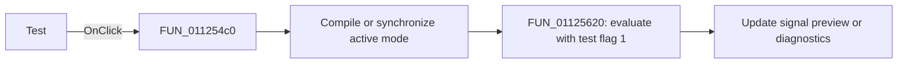

# &Test

> Analysis status: Reviewed against the shared compile-and-test path.

## Control

| Property | Recovered value |
| --- | --- |
| Form | SignalEditorDlg |
| Component path | SignalEditorDlg.PopupMenu.pmiTest |
| Control class | TMenuItem |
| Caption | &Test |
| Hint | Not present in the recovered resource. |
| Text | Not present in the recovered resource. |
| Handler name | pmiTestClick |
| Handler address | 011254c0 |
| Graph node | `resource:dfm:SignalEditorDlg/SignalEditorDlg.PopupMenu.pmiTest` |
| Handler node | `function:011254c0` |
| Graph layer | UI |

## What happens when clicked

The handler first runs the same mode-aware syntax path as `pmiCompile`: it
compiles user-defined mode `8` or synchronizes the piecewise-linear editor for
other modes. It then calls `FUN_01125620`, which invokes the signal evaluation
helper with test flag `1`. That helper uses the compiled user-defined object or
copies the active standard-mode parameters before it evaluates and updates the
preview. Compilation and evaluation diagnostics are handled by the called
functions; this wrapper does not display its own error.

## Click flow

## Handler evidence

- Source: [DecompiledSources/Tina16/functions/00000000011254C0__FUN_011254c0.c](../../../DecompiledSources/Tina16/functions/00000000011254C0__FUN_011254c0.c)
- Recovered role: Compile and test the active signal definition.
- Current graph summary: Handles 1 Delphi UI event: SignalEditorDlg.PopupMenu.pmiTest.OnClick.
- Current graph behavior: Calls the syntax path and then the test wrapper in a fixed order.
- Current graph evidence: The handler body has exactly the calls `FUN_011254a0(param_1)` and `FUN_01125620(param_1)`.
- Complexity: moderate
- Distinct outgoing calls: 2

## Direct calls

- `function:011254a0` — Handles 1 Delphi UI event: SignalEditorDlg.PopupMenu.pmiCompile.OnClick.
- `function:01125620` — FUN_01125620

## Resource evidence

- Kind: Not present in the recovered resource.
- Modal result: Not present in the recovered resource.
- Checked state: Not present in the recovered resource.
- List items: Not present in the recovered resource.
- Image reference: Not present in the recovered resource.
- Extracted glyph: None.

## Nearby label candidates

Nearby labels are layout candidates only. They are not proof of behavior.

- No same-parent label candidate is available.

## Analysis limits

- The recovered wrapper does not branch on the compile result; the evaluation helper performs its own mode and validity checks.
- The exact rendered preview format is outside this call path.
