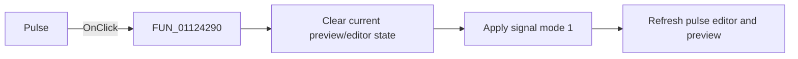

# Pulse|

> Analysis status: Reviewed with the shared signal-mode switch path and pulse glyph.

## Control

| Property | Recovered value |
| --- | --- |
| Form | SignalEditorDlg |
| Component path | SignalEditorDlg.pnlExcitButtons.sbtnPulse |
| Control class | TSpeedButton |
| Caption | Not present in the recovered resource. |
| Hint | Pulse\| |
| Text | Not present in the recovered resource. |
| Handler name | sbtnPulseClick |
| Handler address | 01124290 |
| Graph node | `resource:dfm:SignalEditorDlg/SignalEditorDlg.pnlExcitButtons.sbtnPulse` |
| Handler node | `function:01124290` |
| Graph layer | UI |

## What happens when clicked

The handler clears the current preview/editor state through `FUN_011235a0`, then
calls `FUN_01123730` with signal mode `1` and resource ID `0x22b`. The shared
callee copies or initializes the mode's parameter values, selects the matching
editor page, sets active-mode field `+0xb48` to `1`, refreshes the attribute
controls, and requests a preview update. The pulse-shaped glyph and `Pulse|` hint
agree with this literal mode assignment. This wrapper has no conditional or
separate error path.

## Click flow

## Handler evidence

- Source: [DecompiledSources/Tina16/functions/0000000001124290__FUN_01124290.c](../../../DecompiledSources/Tina16/functions/0000000001124290__FUN_01124290.c)
- Recovered role: Select pulse excitation mode.
- Current graph summary: Handles 1 Delphi UI event: SignalEditorDlg.pnlExcitButtons.sbtnPulse.OnClick.
- Current graph behavior: Calls the shared reset helper, then the shared mode switcher with literal mode `1`.
- Current graph evidence: The handler body passes `(param_1, 0x22b, 1)` to `FUN_01123730`; the extracted glyph is a pulse waveform.
- Complexity: moderate
- Distinct outgoing calls: 2

## Direct calls

- `function:011235a0` — FUN_011235a0
- `function:01123730` — FUN_01123730

## Resource evidence

- Kind: Not present in the recovered resource.
- Modal result: Not present in the recovered resource.
- Checked state: Not present in the recovered resource.
- List items: Not present in the recovered resource.
- Image reference: Not present in the recovered resource.
- Extracted glyph: [`0468_SignalEditorDlg_SignalEditorDlg_pnlExcitButtons_sbtnPulse_Glyph_Data.png`](../../../glyph/0468_SignalEditorDlg_SignalEditorDlg_pnlExcitButtons_sbtnPulse_Glyph_Data.png)

## Nearby label candidates

Nearby labels are layout candidates only. They are not proof of behavior.

- No same-parent label candidate is available.

## Analysis limits

- The resource ID `0x22b` is not mapped to recovered text.
- Lower-level preview errors are outside this wrapper.
