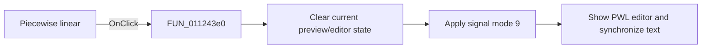

# Piecewise linear|

> Analysis status: Reviewed with the shared signal-mode switch path and PWL glyph.

## Control

| Property | Recovered value |
| --- | --- |
| Form | SignalEditorDlg |
| Component path | SignalEditorDlg.pnlExcitButtons.sbtnPWL |
| Control class | TSpeedButton |
| Caption | Not present in the recovered resource. |
| Hint | Piecewise linear\| |
| Text | Not present in the recovered resource. |
| Handler name | sbtnPWLClick |
| Handler address | 011243e0 |
| Graph node | `resource:dfm:SignalEditorDlg/SignalEditorDlg.pnlExcitButtons.sbtnPWL` |
| Handler node | `function:011243e0` |
| Graph layer | UI |

## What happens when clicked

The handler clears the current preview/editor state through `FUN_011235a0`, then
calls `FUN_01123730` with signal mode `9` and no resource ID (`-1`). The shared
callee moves the current piecewise-linear text between the visible editor and its
backing object, selects the PWL page, writes `9` to active-mode field `+0xb48`,
and updates the mode-specific controls. The piecewise waveform glyph and hint
corroborate the assignment. This wrapper has no conditional or separate error
path.

## Click flow

## Handler evidence

- Source: [DecompiledSources/Tina16/functions/00000000011243E0__FUN_011243e0.c](../../../DecompiledSources/Tina16/functions/00000000011243E0__FUN_011243e0.c)
- Recovered role: Select piecewise-linear excitation mode.
- Current graph summary: Handles 1 Delphi UI event: SignalEditorDlg.pnlExcitButtons.sbtnPWL.OnClick.
- Current graph behavior: Calls the shared reset helper, then the shared mode switcher with literal mode `9`.
- Current graph evidence: The handler body passes `(param_1, -1, 9)` to `FUN_01123730`; the extracted glyph is piecewise linear.
- Complexity: moderate
- Distinct outgoing calls: 2

## Direct calls

- `function:011235a0` — FUN_011235a0
- `function:01123730` — FUN_01123730

## Resource evidence

- Kind: Not present in the recovered resource.
- Modal result: Not present in the recovered resource.
- Checked state: Not present in the recovered resource.
- List items: Not present in the recovered resource.
- Image reference: Not present in the recovered resource.
- Extracted glyph: [`0476_SignalEditorDlg_SignalEditorDlg_pnlExcitButtons_sbtnPWL_Glyph_Data.png`](../../../glyph/0476_SignalEditorDlg_SignalEditorDlg_pnlExcitButtons_sbtnPWL_Glyph_Data.png)

## Nearby label candidates

Nearby labels are layout candidates only. They are not proof of behavior.

- No same-parent label candidate is available.

## Analysis limits

- The source proves text synchronization and page selection, but it does not name the PWL parser result.
- Lower-level parse errors are outside this wrapper.
