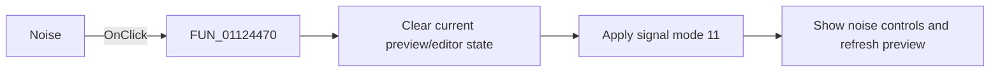

# Noise|

> Analysis status: Reviewed with the shared signal-mode switch path and noise glyph.

## Control

| Property | Recovered value |
| --- | --- |
| Form | SignalEditorDlg |
| Component path | SignalEditorDlg.pnlExcitButtons.sbtnRND |
| Control class | TSpeedButton |
| Caption | Not present in the recovered resource. |
| Hint | Noise\| |
| Text | Not present in the recovered resource. |
| Handler name | sbtnRNDClick |
| Handler address | 01124470 |
| Graph node | `resource:dfm:SignalEditorDlg/SignalEditorDlg.pnlExcitButtons.sbtnRND` |
| Handler node | `function:01124470` |
| Graph layer | UI |

## What happens when clicked

The handler clears the current preview/editor state through `FUN_011235a0`, then
calls `FUN_01123730` with signal mode `11` and no resource ID (`-1`). The shared
callee selects the random/noise page, writes `11` to active-mode field `+0xb48`,
and exposes the noise-mode, RMS, bandwidth, and smoothing-filter controls before
refreshing the preview. The random waveform glyph and Noise hint corroborate the
mode. This wrapper has no conditional or separate error path.

## Click flow

## Handler evidence

- Source: [DecompiledSources/Tina16/functions/0000000001124470__FUN_01124470.c](../../../DecompiledSources/Tina16/functions/0000000001124470__FUN_01124470.c)
- Recovered role: Select random-noise excitation mode.
- Current graph summary: Handles 1 Delphi UI event: SignalEditorDlg.pnlExcitButtons.sbtnRND.OnClick.
- Current graph behavior: Calls the shared reset helper, then the shared mode switcher with literal mode `11`.
- Current graph evidence: The handler body passes `(param_1, -1, 11)` to `FUN_01123730`; the extracted glyph is a random waveform.
- Complexity: moderate
- Distinct outgoing calls: 2

## Direct calls

- `function:011235a0` — FUN_011235a0
- `function:01123730` — FUN_01123730

## Resource evidence

- Kind: Not present in the recovered resource.
- Modal result: Not present in the recovered resource.
- Checked state: Not present in the recovered resource.
- List items: Not present in the recovered resource.
- Image reference: Not present in the recovered resource.
- Extracted glyph: [`0478_SignalEditorDlg_SignalEditorDlg_pnlExcitButtons_sbtnRND_Glyph_Data.png`](../../../glyph/0478_SignalEditorDlg_SignalEditorDlg_pnlExcitButtons_sbtnRND_Glyph_Data.png)

## Nearby label candidates

Nearby labels are layout candidates only. They are not proof of behavior.

- No same-parent label candidate is available.

## Analysis limits

- The source does not name the numeric noise-mode values.
- Lower-level preview errors are outside this wrapper.
