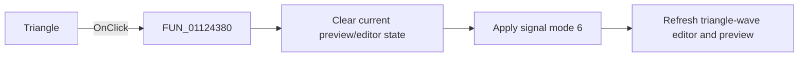

# Triangle|

> Analysis status: Reviewed with the shared signal-mode switch path and triangle-wave glyph.

## Control

| Property | Recovered value |
| --- | --- |
| Form | SignalEditorDlg |
| Component path | SignalEditorDlg.pnlExcitButtons.sbtnTriangle |
| Control class | TSpeedButton |
| Caption | Not present in the recovered resource. |
| Hint | Triangle\| |
| Text | Not present in the recovered resource. |
| Handler name | sbtnTriangleClick |
| Handler address | 01124380 |
| Graph node | `resource:dfm:SignalEditorDlg/SignalEditorDlg.pnlExcitButtons.sbtnTriangle` |
| Handler node | `function:01124380` |
| Graph layer | UI |

## What happens when clicked

The handler clears the current preview/editor state through `FUN_011235a0`, then
calls `FUN_01123730` with signal mode `6` and resource ID `0x23e`. The shared
callee copies or initializes the mode's parameters, selects its editor page,
writes `6` to active-mode field `+0xb48`, refreshes the attribute controls, and
requests a preview update. The triangle-wave glyph and hint corroborate the mode.
This wrapper has no conditional or separate error path.

## Click flow

## Handler evidence

- Source: [DecompiledSources/Tina16/functions/0000000001124380__FUN_01124380.c](../../../DecompiledSources/Tina16/functions/0000000001124380__FUN_01124380.c)
- Recovered role: Select triangle-wave excitation mode.
- Current graph summary: Handles 1 Delphi UI event: SignalEditorDlg.pnlExcitButtons.sbtnTriangle.OnClick.
- Current graph behavior: Calls the shared reset helper, then the shared mode switcher with literal mode `6`.
- Current graph evidence: The handler body passes `(param_1, 0x23e, 6)` to `FUN_01123730`; the extracted glyph is a triangle wave.
- Complexity: moderate
- Distinct outgoing calls: 2

## Direct calls

- `function:011235a0` — FUN_011235a0
- `function:01123730` — FUN_01123730

## Resource evidence

- Kind: Not present in the recovered resource.
- Modal result: Not present in the recovered resource.
- Checked state: Not present in the recovered resource.
- List items: Not present in the recovered resource.
- Image reference: Not present in the recovered resource.
- Extracted glyph: [`0473_SignalEditorDlg_SignalEditorDlg_pnlExcitButtons_sbtnTriangle_Glyph_Data.png`](../../../glyph/0473_SignalEditorDlg_SignalEditorDlg_pnlExcitButtons_sbtnTriangle_Glyph_Data.png)

## Nearby label candidates

Nearby labels are layout candidates only. They are not proof of behavior.

- No same-parent label candidate is available.

## Analysis limits

- The resource ID `0x23e` is not mapped to recovered text.
- Lower-level preview errors are outside this wrapper.
