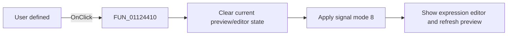

# User defined|

> Analysis status: Reviewed with the shared signal-mode switch path and user-defined glyph.

## Control

| Property | Recovered value |
| --- | --- |
| Form | SignalEditorDlg |
| Component path | SignalEditorDlg.pnlExcitButtons.sbtnUserDefined |
| Control class | TSpeedButton |
| Caption | Not present in the recovered resource. |
| Hint | User defined\| |
| Text | Not present in the recovered resource. |
| Handler name | sbtnUserDefinedClick |
| Handler address | 01124410 |
| Graph node | `resource:dfm:SignalEditorDlg/SignalEditorDlg.pnlExcitButtons.sbtnUserDefined` |
| Handler node | `function:01124410` |
| Graph layer | UI |

## What happens when clicked

The handler clears the current preview/editor state through `FUN_011235a0`, then
calls `FUN_01123730` with signal mode `8` and no resource ID (`-1`). The shared
callee transfers the current expression text into the user-defined editor,
selects that editor page, enables its local controls, writes `8` to active-mode
field `+0xb48`, and refreshes the preview. The `Signal(t)` glyph and User defined
hint corroborate this mode. This wrapper has no conditional or separate error
path.

## Click flow

## Handler evidence

- Source: [DecompiledSources/Tina16/functions/0000000001124410__FUN_01124410.c](../../../DecompiledSources/Tina16/functions/0000000001124410__FUN_01124410.c)
- Recovered role: Select user-defined expression mode.
- Current graph summary: Handles 1 Delphi UI event: SignalEditorDlg.pnlExcitButtons.sbtnUserDefined.OnClick.
- Current graph behavior: Calls the shared reset helper, then the shared mode switcher with literal mode `8`.
- Current graph evidence: The handler body passes `(param_1, -1, 8)` to `FUN_01123730`; the extracted glyph reads `Signal(t)`.
- Complexity: moderate
- Distinct outgoing calls: 2

## Direct calls

- `function:011235a0` — FUN_011235a0
- `function:01123730` — FUN_01123730

## Resource evidence

- Kind: Not present in the recovered resource.
- Modal result: Not present in the recovered resource.
- Checked state: Not present in the recovered resource.
- List items: Not present in the recovered resource.
- Image reference: Not present in the recovered resource.
- Extracted glyph: [`0475_SignalEditorDlg_SignalEditorDlg_pnlExcitButtons_sbtnUserDefined_Glyph_Data.png`](../../../glyph/0475_SignalEditorDlg_SignalEditorDlg_pnlExcitButtons_sbtnUserDefined_Glyph_Data.png)

## Nearby label candidates

Nearby labels are layout candidates only. They are not proof of behavior.

- No same-parent label candidate is available.

## Analysis limits

- Compilation occurs in a later syntax or test path, not in this wrapper.
- Lower-level editor errors are outside this wrapper.
