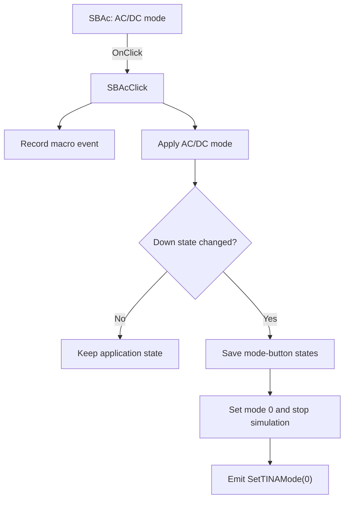

# Set AC/DC mode

> Analysis status: Evidence-backed source review complete.

## Control

| Property | Recovered value |
| --- | --- |
| Form | SimTimeDlg |
| Component path | SimTimeDlg.SBAc |
| Control class | TSpeedButton |
| Caption | Not present in the recovered resource. |
| Hint | Set AC/DC mode |
| Text | Not present in the recovered resource. |
| Handler name | SBAcClick |
| Handler address | 0132b370 |
| Graph node | `resource:dfm:SimTimeDlg/SimTimeDlg.SBAc` |
| Handler node | `function:0132b370` |
| Graph layer | UI |

## What happens when clicked

The handler first records a control-specific macro event. It then calls the AC/DC mode routine. That routine compares the current `SBAc.Down` byte with the saved byte at form offset `+0x710`. If the state did not change, it makes no application-state change after the macro record.

If the state changed, the routine saves the three mode-button states, writes mode value `0` at form offset `+0x71c`, forces the Start/Stop button off, and runs the shared stop path. It enables both transient-mode buttons, sets the global simulation-state byte at `+0x813` to `1`, and emits `[SetTINAMode(0)]`. The `SBAcClick` wrapper does not branch on `Sender`. No local exception handler is present.

## Click flow

## Handler evidence

- Source: [DecompiledSources/Tina16/functions/000000000132B370__FUN_0132b370.c](../../../DecompiledSources/Tina16/functions/000000000132B370__FUN_0132b370.c)
- Recovered role: Record the SBAc macro event and apply the AC/DC simulation mode transition.
- Current graph summary: Handles 1 Delphi UI event: SimTimeDlg.SBAc.OnClick.
- Current graph behavior: Delegates to a state-change guard. A changed button state selects mode 0, stops an active run, restores both transient-mode buttons, and sends the application mode-0 command.
- Current graph evidence: `FUN_0132b370` calls the macro-event dispatcher and `FUN_0132b2d0`. The latter compares `SBAc.Down` with `+0x710`, writes `0` to `+0x71c`, forces the Start/Stop control down state to false, calls the common run-state routine, and reaches `FUN_013a4400`, whose recovered string is `[SetTINAMode(0)]`.
- Complexity: complex
- Distinct outgoing calls: 4

## Direct calls

- `function:00414480` — Delphi UnicodeString clear and finalization helper
- `function:00414b50` — Assign the static macro token string.
- `function:0132b2d0` — Apply the guarded AC/DC mode transition.
- `function:013a4ea0` — Format and dispatch a macro event.

Reviewed application callees: [mode transition](../../../DecompiledSources/Tina16/functions/000000000132B2D0__FUN_0132b2d0.c), [mode-state snapshot](../../../DecompiledSources/Tina16/functions/000000000132B660__FUN_0132b660.c), [shared run-state routine](../../../DecompiledSources/Tina16/functions/000000000132B070__FUN_0132b070.c), and [application mode-0 command](../../../DecompiledSources/Tina16/functions/00000000013A4400__FUN_013a4400.c).

## Resource evidence

- Kind: Not present in the recovered resource.
- Modal result: Not present in the recovered resource.
- Checked state: Not present in the recovered resource.
- List items: Not present in the recovered resource.
- Image reference: Not present in the recovered resource.
- Extracted glyph: [`0479_SimTimeDlg_SimTimeDlg_SBAc_Glyph_Data.png`](../../../glyph/0479_SimTimeDlg_SimTimeDlg_SBAc_Glyph_Data.png)

## Nearby label candidates

Nearby labels are layout candidates only. They are not proof of behavior.

- Rank 1: s at distance 175.

## Analysis limits

- Do not infer behavior from the control class, caption, hint, glyph, or nearby label alone.
- The recovered code identifies the state offsets and command strings but not their original Delphi field names. The nearby `s` label is not used as behavioral evidence.
