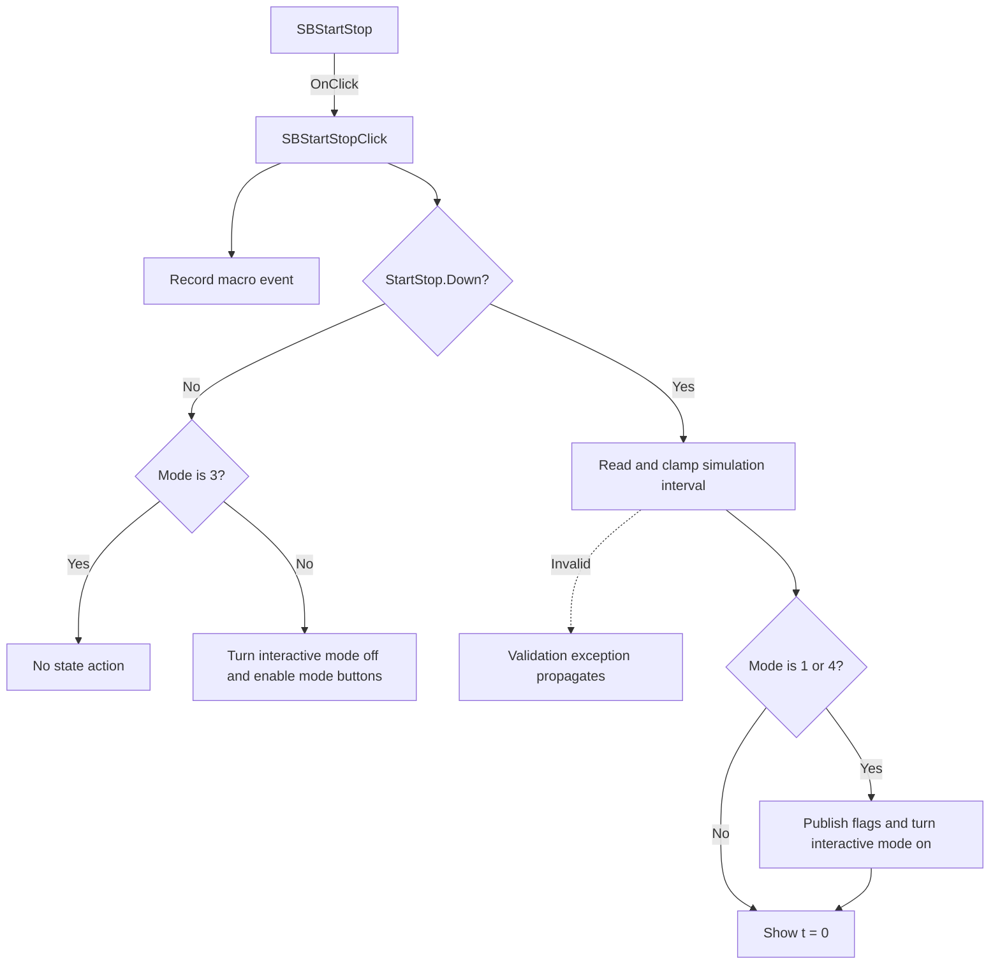

# Start/Stop simulation

> Analysis status: Evidence-backed source review complete.

## Control

| Property | Recovered value |
| --- | --- |
| Form | SimTimeDlg |
| Component path | SimTimeDlg.SBStartStop |
| Control class | TSpeedButton |
| Caption | Not present in the recovered resource. |
| Hint | Start/Stop simulation |
| Text | Not present in the recovered resource. |
| Handler name | SBStartStopClick |
| Handler address | 0132b240 |
| Graph node | `resource:dfm:SimTimeDlg/SimTimeDlg.SBStartStop` |
| Handler node | `function:0132b240` |
| Graph layer | UI |

## What happens when clicked

The handler first records a control-specific macro event and then evaluates `SBStartStop.Down`. It does not branch on `Sender`.

When the button is off and the internal mode is not `3`, the routine forces the schematic editor's `ToolInteractive` control off, invokes its `Interactive mode On/Off` handler, refreshes the simulation-dependent state, and enables both transient-mode buttons. Mode `3` instead calls a recovered one-instruction no-op and makes no state change after the macro record.

When the button is on, the routine reads the simulation interval from the form editor. The numeric reader can raise an application exception for an out-of-range value or a failed validation callback; this handler does not catch it. A value less than `1e-6` is clamped to `1e-6`. Internal mode `1` disables the continuous button, and mode `4` disables the single button. For either supported transient mode, the routine publishes the simulation flags, clears a global state byte, forces `ToolInteractive` on, and invokes its handler. It then writes and reports ` t =  0`. Other mode values do not activate interactive simulation, but they still reach the time-zero display after a valid interval is read.

## Click flow

## Handler evidence

- Source: [DecompiledSources/Tina16/functions/000000000132B240__FUN_0132b240.c](../../../DecompiledSources/Tina16/functions/000000000132B240__FUN_0132b240.c)
- Recovered role: Record the SBStartStop macro event and run the simulation start-or-stop state machine.
- Current graph summary: Handles 1 Delphi UI event: SimTimeDlg.SBStartStop.OnClick.
- Current graph behavior: Stops interactive simulation when the toggle is off. When it is on in single or continuous transient mode, validates and clamps the interval, publishes run flags, starts interactive mode, and reports time zero.
- Current graph evidence: `FUN_0132b240` calls the macro-event dispatcher and `FUN_0132b070`. The latter tests the Start/Stop button byte at `+0x328` and the mode byte at `+0x71c`, reads the form editor through `FUN_00b90090`, clamps the shared interval to `1e-6`, changes the opposite mode-button enabled state, drives the recovered `Interactive mode On/Off` handler `FUN_01c87e40`, and passes ` t =  0` to `FUN_0132bb80`.
- Complexity: complex
- Distinct outgoing calls: 4

## Direct calls

- `function:00414480` — Delphi UnicodeString clear and finalization helper
- `function:00414b50` — Assign the static macro token string.
- `function:0132b070` — Apply the simulation start-or-stop state machine.
- `function:013a4ea0` — Format and dispatch a macro event.

Reviewed application callees: [run-state routine](../../../DecompiledSources/Tina16/functions/000000000132B070__FUN_0132b070.c), [simulation flag publisher](../../../DecompiledSources/Tina16/functions/000000000132B610__FUN_0132b610.c), [time-zero display and message routine](../../../DecompiledSources/Tina16/functions/000000000132BB80__FUN_0132bb80.c), [numeric editor reader](../../../DecompiledSources/Tina16/functions/0000000000B90090__FUN_00b90090.c), and [interactive-mode handler](../../../DecompiledSources/Tina16/functions/0000000001C87E40__FUN_01c87e40.c).

## Resource evidence

- Kind: Not present in the recovered resource.
- Modal result: Not present in the recovered resource.
- Checked state: Not present in the recovered resource.
- List items: Not present in the recovered resource.
- Image reference: Not present in the recovered resource.
- Extracted glyph: [`0482_SimTimeDlg_SimTimeDlg_SBStartStop_Glyph_Data.png`](../../../glyph/0482_SimTimeDlg_SimTimeDlg_SBStartStop_Glyph_Data.png)

## Nearby label candidates

Nearby labels are layout candidates only. They are not proof of behavior.

- Rank 1: s at distance 51.

## Analysis limits

- Do not infer behavior from the control class, caption, hint, glyph, or nearby label alone.
- The recovered code identifies mode values and field offsets but not their original Delphi field names. The start path's later simulation engine internals remain outside this control article. The nearby `s` label is not used as behavioral evidence.
