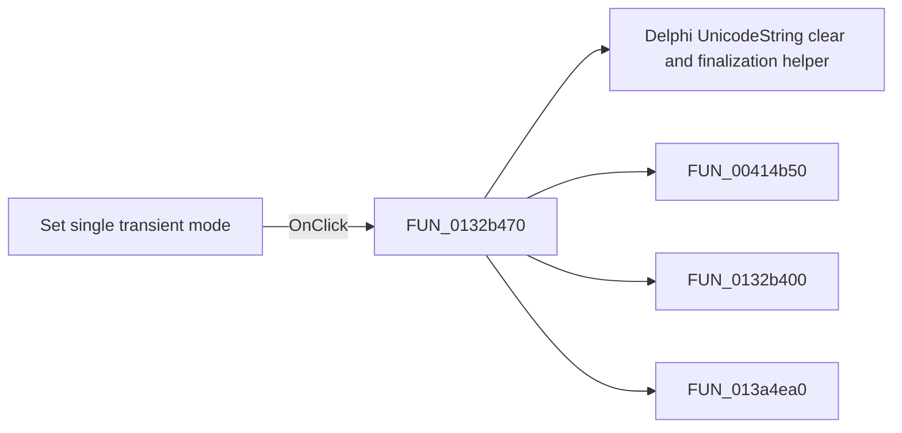

# Set single transient mode

> Analysis status: Pending individual source review.

## Control

| Property | Recovered value |
| --- | --- |
| Form | SimTimeDlg |
| Component path | SimTimeDlg.SBTrSing |
| Control class | TSpeedButton |
| Caption | Not present in the recovered resource. |
| Hint | Set single transient mode |
| Text | Not present in the recovered resource. |
| Handler name | SBTrSingClick |
| Handler address | 0132b470 |
| Graph node | `resource:dfm:SimTimeDlg/SimTimeDlg.SBTrSing` |
| Handler node | `function:0132b470` |
| Graph layer | UI |

## What happens when clicked

Pending individual analysis. An agent must read the recovered handler source and its relevant callees before it replaces this text.

## Click flow

## Handler evidence

- Source: [DecompiledSources/Tina16/functions/000000000132B470__FUN_0132b470.c](../../../DecompiledSources/Tina16/functions/000000000132B470__FUN_0132b470.c)
- Recovered role: Not present in the recovered resource.
- Current graph summary: Handles 1 Delphi UI event: SimTimeDlg.SBTrSing.OnClick.
- Current graph behavior: Not present in the recovered resource.
- Current graph evidence: Not present in the recovered resource.
- Complexity: complex
- Distinct outgoing calls: 4

## Direct calls

- `function:00414480` — Delphi UnicodeString clear and finalization helper
- `function:00414b50` — FUN_00414b50
- `function:0132b400` — FUN_0132b400
- `function:013a4ea0` — FUN_013a4ea0

## Resource evidence

- Kind: Not present in the recovered resource.
- Modal result: Not present in the recovered resource.
- Checked state: Not present in the recovered resource.
- List items: Not present in the recovered resource.
- Image reference: Not present in the recovered resource.
- Extracted glyph: [`0480_SimTimeDlg_SimTimeDlg_SBTrSing_Glyph_Data.png`](../../../glyph/0480_SimTimeDlg_SimTimeDlg_SBTrSing_Glyph_Data.png)

## Nearby label candidates

Nearby labels are layout candidates only. They are not proof of behavior.

- Rank 1: s at distance 142.

## Analysis limits

- Do not infer behavior from the control class, caption, hint, glyph, or nearby label alone.
- Do not replace the pending status until the handler source and relevant call path provide enough evidence.
