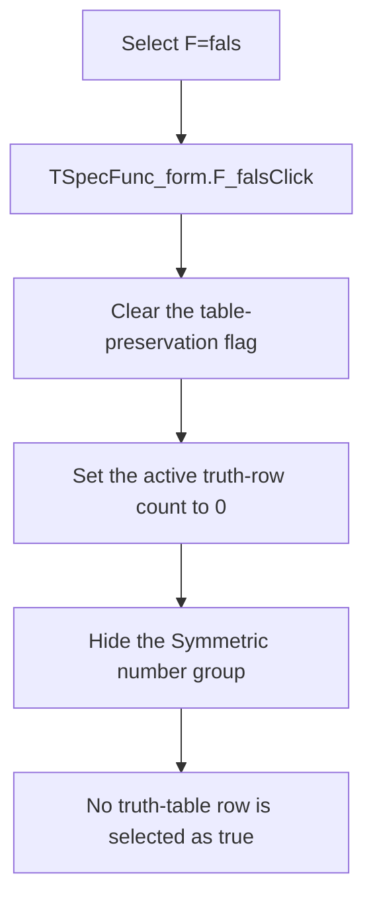

# F=fals

> Analysis status: Reviewed against the recovered handler, shared visibility setter, form lifecycle, and selection-state consumers.

## Control

| Property | Recovered value |
| --- | --- |
| Form | SpecFunc_form |
| Component path | SpecFunc_form.F_fals |
| Control class | TRadioButton |
| Caption | F=fals |
| Hint | Not present in the recovered resource. |
| Text | Not present in the recovered resource. |
| Handler name | F_falsClick |
| Handler address | 011aa360 |
| Graph node | `resource:dfm:SpecFunc_form/SpecFunc_form.F_fals` |
| Handler node | `function:011aa360` |
| Graph layer | UI |

## What happens when clicked

The handler selects the constant-false special function. It clears the recovered table-preservation flag, sets the active truth-row count to zero, and hides the `Symmetric number` group. Consumers use this count and its index array as the set of truth-table rows where the function is true. A zero count therefore represents no true rows.

The handler does not erase old index-array entries, but the zero count makes those entries inactive. A repeated click keeps the count at zero. The shared visibility setter does nothing when the group is already hidden. The handler has no error branch and does not close the form.

## Click flow

## Handler evidence

- Source: [DecompiledSources/Tina16/functions/00000000011AA360__FUN_011aa360.c](../../../DecompiledSources/Tina16/functions/00000000011AA360__FUN_011aa360.c)
- Recovered role: Select the constant-false special function.
- Current graph summary: Handles 1 Delphi UI event: SpecFunc_form.F_fals.OnClick.
- Current graph behavior: Not present in the recovered resource.
- Current graph evidence: Not present in the recovered resource.
- Complexity: simple
- Distinct outgoing calls: 1

## Direct calls

- `function:0064dbe0` — changes the `Symmetric number` group visibility only when needed.

## Resource evidence

- Kind: Not present in the recovered resource.
- Modal result: Not present in the recovered resource.
- Checked state: true
- List items: Not present in the recovered resource.
- Image reference: Not present in the recovered resource.
- Extracted glyph: None.

## Nearby label candidates

Nearby labels are layout candidates only. They are not proof of behavior.

- No same-parent label candidate is available.

## Analysis limits

- The Delphi names of the global count, index array, and table-preservation flag are not recovered.
- The handler leaves inactive index-array entries in memory. Recovered consumers honor only entries below the count.
