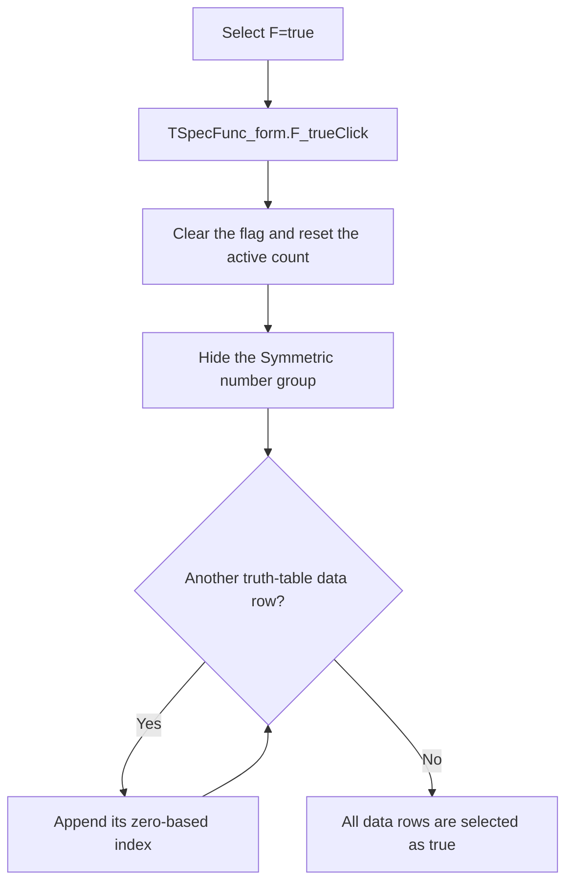

# F=true

> Analysis status: Reviewed against the recovered handler, shared visibility setter, form lifecycle, and selection-state consumers.

## Control

| Property | Recovered value |
| --- | --- |
| Form | SpecFunc_form |
| Component path | SpecFunc_form.F_true |
| Control class | TRadioButton |
| Caption | F=true |
| Hint | Not present in the recovered resource. |
| Text | Not present in the recovered resource. |
| Handler name | F_trueClick |
| Handler address | 011aa3a0 |
| Graph node | `resource:dfm:SpecFunc_form/SpecFunc_form.F_true` |
| Handler node | `function:011aa3a0` |
| Graph layer | UI |

## What happens when clicked

The handler selects the constant-true special function. It clears the recovered table-preservation flag and resets the active truth-row count. It then hides the `Symmetric number` group and reads the truth-table grid row count. For every data row after the grid header, it appends the zero-based row index to the active index array and increments the count.

Consumers convert each listed index into a true output row. Listing all data-row indices therefore represents a function that is true for every input combination. If the recovered grid count has no data row, the loop performs no write and the count stays zero. A repeated click rebuilds the same list. The handler has no error branch and does not close the form.

## Click flow

## Handler evidence

- Source: [DecompiledSources/Tina16/functions/00000000011AA3A0__FUN_011aa3a0.c](../../../DecompiledSources/Tina16/functions/00000000011AA3A0__FUN_011aa3a0.c)
- Recovered role: Select the constant-true special function.
- Current graph summary: Handles 1 Delphi UI event: SpecFunc_form.F_true.OnClick.
- Current graph behavior: Not present in the recovered resource.
- Current graph evidence: Not present in the recovered resource.
- Complexity: simple
- Distinct outgoing calls: 1

## Direct calls

- `function:0064dbe0` — changes the `Symmetric number` group visibility only when needed.

## Resource evidence

- Kind: Not present in the recovered resource.
- Modal result: Not present in the recovered resource.
- Checked state: Not present in the recovered resource.
- List items: Not present in the recovered resource.
- Image reference: Not present in the recovered resource.
- Extracted glyph: None.

## Nearby label candidates

Nearby labels are layout candidates only. They are not proof of behavior.

- No same-parent label candidate is available.

## Analysis limits

- The Delphi names of the global count, index array, and table-preservation flag are not recovered.
- The grid field at offset `0x4e0` behaves as the row count. The handler subtracts one for the header row.
