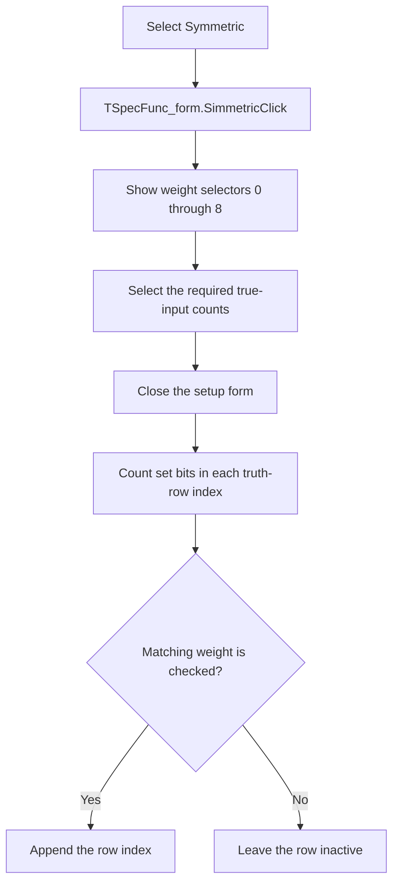

# Symmetric

> Analysis status: Reviewed against the recovered click handler, form activation and close handlers, bit-count helper, and form resources.

## Control

| Property | Recovered value |
| --- | --- |
| Form | SpecFunc_form |
| Component path | SpecFunc_form.Simmetric |
| Control class | TRadioButton |
| Caption | Symmetric |
| Hint | Not present in the recovered resource. |
| Text | Not present in the recovered resource. |
| Handler name | SimmetricClick |
| Handler address | 011aa540 |
| Graph node | `resource:dfm:SpecFunc_form/SpecFunc_form.Simmetric` |
| Handler node | `function:011aa540` |
| Graph layer | UI |

## What happens when clicked

The click handler selects symmetric-function setup. It makes the `Symmetric number` group visible and clears the recovered table-preservation flag. The group contains check boxes labeled `0` through `8`. The click does not immediately change the active truth-row count or index array.

The form activation handler keeps only weight selectors `0` through the current variable count visible. When the form closes with the group visible, `TSpecFunc_form.FormClose` reads those check boxes, clears the active count, and examines every truth-table data row. `FUN_0119a4f0` counts the set bits in the row index. The close handler appends the row index only when the check box for that bit count is selected. The resulting function therefore depends on the number of true inputs, not their positions.

A repeated click leaves the group visible and clears the same flag again. It does not commit the check-box choices until the close handler runs. No recovered error branch reports an invalid selection; an empty set of checked weights produces no active true rows.

## Click flow

## Handler evidence

- Source: [DecompiledSources/Tina16/functions/00000000011AA540__FUN_011aa540.c](../../../DecompiledSources/Tina16/functions/00000000011AA540__FUN_011aa540.c)
- Recovered role: Open symmetric-function weight selection.
- Current graph summary: Handles 1 Delphi UI event: SpecFunc_form.Simmetric.OnClick.
- Current graph behavior: Not present in the recovered resource.
- Current graph evidence: Not present in the recovered resource.
- Complexity: simple
- Distinct outgoing calls: 1

## Direct calls

- `function:0064dbe0` — makes the `Symmetric number` group visible only when needed.

## Deferred state consumers

- [Form activation handler `FUN_011aa450`](../../../DecompiledSources/Tina16/functions/00000000011AA450__FUN_011aa450.c) applies the current variable-count limit to the nine weight check boxes.
- [Form close handler `FUN_011aa570`](../../../DecompiledSources/Tina16/functions/00000000011AA570__FUN_011aa570.c) rebuilds the active truth-row list from the selected weights.
- [Bit-count helper `FUN_0119a4f0`](../../../DecompiledSources/Tina16/functions/000000000119A4F0__FUN_0119a4f0.c) counts set bits in the low eight bits of each row index.

## Resource evidence

- Kind: Not present in the recovered resource.
- Modal result: Not present in the recovered resource.
- Checked state: Not present in the recovered resource.
- List items: Not present in the recovered resource.
- Image reference: Not present in the recovered resource.
- Extracted glyph: None.

## Nearby label candidates

Nearby labels are layout candidates only. They are not proof of behavior.

- No same-parent label candidate is available.

## Analysis limits

- The Delphi names of the global count, index array, and table-preservation flag are not recovered.
- The click only exposes the selectors. The form-close event is the proven commit point for the selected weights.
