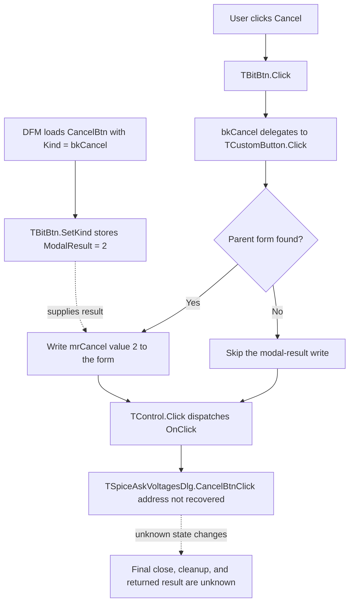

# Cancel

> Analysis status: The standard VCL cancel request is recovered. The custom handler and final form outcome remain unresolved.

## Control

| Property | Recovered value |
| --- | --- |
| Form | SpiceAskVoltagesDlg |
| Form caption | Voltages/Currents |
| Component path | SpiceAskVoltagesDlg.BtnPanel.CancelBtn |
| Control class | TBitBtn |
| Button kind | bkCancel |
| Caption | Supplied by the predefined button kind; not stored explicitly in the DFM. |
| Hint | Not present in the recovered resource. |
| Handler name | CancelBtnClick |
| Handler address | Not recovered |
| Graph node | `resource:dfm:SpiceAskVoltagesDlg/SpiceAskVoltagesDlg.BtnPanel.CancelBtn` |
| Handler node | `concept:dfm-handler:TSpiceAskVoltagesDlg/CancelBtnClick` |
| Graph layer | tina.exe |

## What happens when clicked

The recovered VCL path proves that this button requests a cancel result before it dispatches the custom click handler:

1. The DFM loader applies `Kind = bkCancel` to the `TBitBtn`. The recovered `TBitBtn.SetKind` path uses kind index 2. The modal-result table at virtual address `01e17818` contains value 2 at that index, the Delphi `mrCancel` value. The same path applies the predefined button presentation and marks this kind as a cancel button.
2. `TBitBtn.Click` has special branches only for `bkHelp` and `bkClose`. A `bkCancel` click delegates to the inherited button-click path.
3. The inherited path searches for the parent form. If it finds one, it copies modal result 2 from the button to the form.
4. The same inherited path then calls the common VCL control-click dispatcher. That dispatcher invokes `TSpiceAskVoltagesDlg.CancelBtnClick` with the button as `Sender`.

The modal-result write occurs before the custom `OnClick` dispatch. Therefore, the standard path requests cancellation, but the unresolved handler can still clear the modal result, change form or model state, show a message, or perform cleanup.

If no parent form is found, the inherited path skips the modal-result write but still dispatches `OnClick`. The DFM places the button inside a panel owned by `SpiceAskVoltagesDlg`, so this is a framework fallback rather than the expected resource hierarchy.

## Cancel flow

## Recovered VCL call path

- [`FUN_0082bc30`](../../../DecompiledSources/Tina16/functions/000000000082BC30__FUN_0082bc30.c) is the recovered `TBitBtn.SetKind` path. It selects a predefined caption, modal result, stock glyph, and default or cancel state from the button-kind index.
- [`FUN_0082b0e0`](../../../DecompiledSources/Tina16/functions/000000000082B0E0__FUN_0082b0e0.c) is the recovered `TBitBtn.Click` override. Kind value 2 uses its inherited-click branch.
- [`FUN_00687f30`](../../../DecompiledSources/Tina16/functions/0000000000687F30__FUN_00687f30.c) finds the parent form, copies the button modal result at offset `0x4f0` to form offset `0x508`, and then calls the common click dispatcher.
- [`FUN_00650840`](../../../DecompiledSources/Tina16/functions/0000000000650840__FUN_00650840.c) invokes an assigned click event or its action-link fallback.
- [Recovered DFM evidence](../../../DecompiledSources/Tina16/resources/dfm/ui-evidence.json) supplies the form, panel, button kind, event name, and unresolved handler mapping.

## Form context

The recovered resource contains six components:

- The form caption is **Voltages/Currents**.
- The main client panel contains one `TViewGrid` named `StringGrid`.
- The bottom button panel contains this `bkCancel` button and a separate `bkHelp` button.
- The form has unresolved `OnCreate`, `OnShow`, `OnResize`, `OnClose`, and `OnDestroy` methods.
- The Cancel button has no explicit caption, hint, embedded glyph bytes, image reference, nearby label candidate, or explicit `ModalResult` property in the DFM. Its cancel semantics come from `Kind = bkCancel` and the recovered VCL kind table.

This context identifies a voltage-and-current grid dialog. It does not prove what data the custom cancel handler restores, frees, or keeps.

## Custom-handler gap

The graph contains one `triggers` edge from the button resource to the unresolved handler concept. The concept has no address, recovered function node, outgoing call edge, or handler source file.

A read-only search found `TSpiceAskVoltagesDlg` once in each captured runtime image, rebuilt image, and process dump. That occurrence belongs to the embedded form resource; no second class-name instance identifies a VMT and published-method table. The recovered C source also has no class-name or handler-name reference that can map `CancelBtnClick` to an address.

## Inputs, outputs, and limits

| Question | Proven result |
| --- | --- |
| Framework input | A click on the `bkCancel` button. |
| Framework state change | The parent form modal result is set to 2 when a parent form is found. |
| Custom handler input | The VCL dispatcher passes `CancelBtn` as `Sender`. |
| Grid or model rollback | Unknown because `CancelBtnClick` is unresolved. |
| Cleanup | Unknown; the form lifecycle handlers are also unresolved. |
| Final result | The framework requests `mrCancel`, but the custom handler can change the result or form state. |
| No-parent fallback | Skip the modal-result write and still dispatch the custom event. |
| Error behavior | No handler-level validation, message, exception path, or recovery rule is recovered. |

## Analysis limits

- `bkCancel` proves the framework cancel request. It does not prove the custom rollback or cleanup behavior.
- No caller or modal-result consumer for this form is recovered, so the final returned value is not assigned to an application action.
- Recovering the custom behavior requires an address-backed VMT or published-method mapping for `TSpiceAskVoltagesDlg`.

