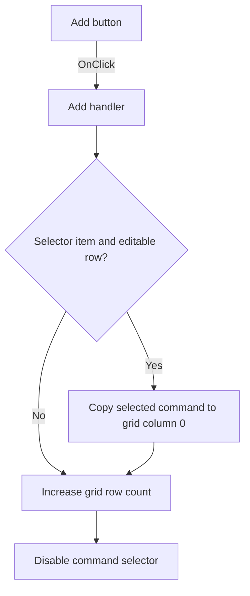

# Add

> Analysis status: Individually reviewed from recovered source.

## Control

| Property | Recovered value |
| --- | --- |
| Form | SpiceCommandEditor |
| Component path | SpiceCommandEditor.pnlButtons.btnAdd |
| Control class | TButton |
| Caption | Add |
| Hint | Not present in the recovered resource. |
| Text | Not present in the recovered resource. |
| Handler name | btnAddClick |
| Handler address | 01472480 |
| Graph node | `resource:dfm:SpiceCommandEditor/SpiceCommandEditor.pnlButtons.btnAdd` |
| Handler node | `function:01472480` |
| Graph layer | UI |

## What happens when clicked

The handler first preserves an unfinished command-name edit when the command selector has a selected item and the remembered grid row is below the header. It copies the selected item into column 0 of that row. It then increases the string grid row count by one and disables the command selector. The new row is blank until the user edits it. A missing selector choice prevents only the preservation step; it does not prevent the new row from being added.

## Click flow

## Handler evidence

- Source: [DecompiledSources/Tina16/functions/0000000001472480__FUN_01472480.c](../../../DecompiledSources/Tina16/functions/0000000001472480__FUN_01472480.c)
- Recovered role: Appends a blank command row after preserving a pending command selection.
- Current graph summary: Handles 1 Delphi UI event: SpiceCommandEditor.pnlButtons.btnAdd.OnClick.
- Current graph behavior: Conditionally copies the selected command name to the remembered data row, appends one grid row, and disables the selector.
- Current graph evidence: The handler tests the selector index and form row field `+0x720`, reads the selected item, writes grid cell `(0, +0x720)`, calls the row-count setter with `RowCount + 1`, and passes false to the selector enabled-state setter.
- Complexity: complex
- Distinct outgoing calls: 4

## Direct calls

- `function:00414480` — finalizes the temporary selected-item string.
- `function:0064dbe0` — sets the selector enabled state to false.
- `function:00848a70` — updates the grid row count and enforces its minimum.
- `function:0084e3e0` — writes the selected command text to a grid cell and refreshes the grid structures.

## Resource evidence

- Kind: Not present in the recovered resource.
- Modal result: Not present in the recovered resource.
- Checked state: Not present in the recovered resource.
- List items: Not present in the recovered resource.
- Image reference: Not present in the recovered resource.
- Extracted glyph: None.

## Nearby label candidates

Nearby labels are layout candidates only. They are not proof of behavior.

- No same-parent label candidate is available.

## Analysis limits

- The recovered source does not identify a Delphi field name for form offset `+0x720`; the grid selection handler shows that it stores the current row.
- This handler does not initialize the new row's cells and does not validate command text.
