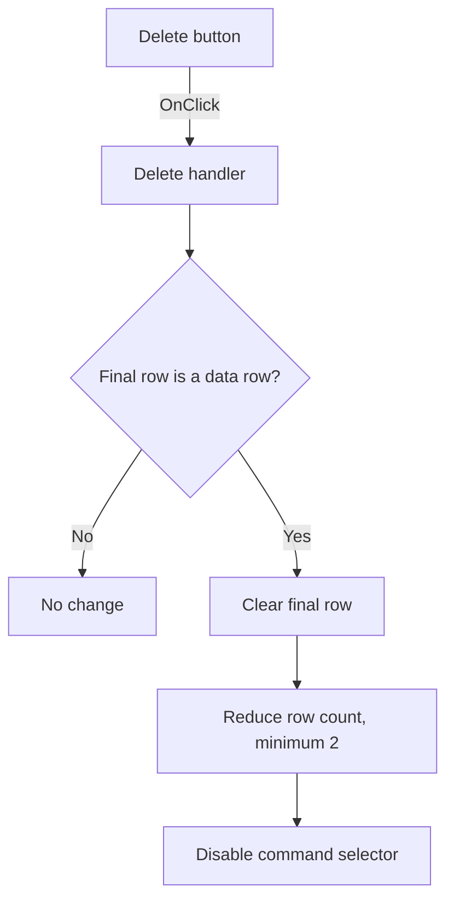

# Delete

> Analysis status: Individually reviewed from recovered source.

## Control

| Property | Recovered value |
| --- | --- |
| Form | SpiceCommandEditor |
| Component path | SpiceCommandEditor.pnlButtons.btnDelete |
| Control class | TButton |
| Caption | Delete |
| Hint | Not present in the recovered resource. |
| Text | Not present in the recovered resource. |
| Handler name | btnDeleteClick |
| Handler address | 01472580 |
| Graph node | `resource:dfm:SpiceCommandEditor/SpiceCommandEditor.pnlButtons.btnDelete` |
| Handler node | `function:01472580` |
| Graph layer | UI |

## What happens when clicked

The handler targets the final grid row, not the selected row. If the final row is a data row, it clears that row, reduces the row count by one, and disables the command selector. It clamps the requested row count to at least two, so deleting the last available data row clears it but keeps the grid's minimum layout. If no data row exists after the fixed header rows, the click has no effect.

## Click flow

## Handler evidence

- Source: [DecompiledSources/Tina16/functions/0000000001472580__FUN_01472580.c](../../../DecompiledSources/Tina16/functions/0000000001472580__FUN_01472580.c)
- Recovered role: Removes the final command row while preserving the grid minimum.
- Current graph summary: Handles 1 Delphi UI event: SpiceCommandEditor.pnlButtons.btnDelete.OnClick.
- Current graph behavior: Clears the last data row, reduces row count with a minimum of two, and disables the command selector.
- Current graph evidence: The handler compares `RowCount - 1` with `FixedRows`, clears the returned row object through virtual slot `+0x90`, calls the row-count setter with `max(RowCount - 1, 2)`, and passes false to the selector enabled-state setter.
- Complexity: complex
- Distinct outgoing calls: 3

## Direct calls

- `function:0064dbe0` — sets the selector enabled state to false.
- `function:00848a70` — updates the grid row count and enforces its internal minimum.
- `function:0084e3c0` — obtains the grid row object that the handler clears.

## Resource evidence

- Kind: Not present in the recovered resource.
- Modal result: Not present in the recovered resource.
- Checked state: Not present in the recovered resource.
- List items: Not present in the recovered resource.
- Image reference: Not present in the recovered resource.
- Extracted glyph: None.

## Nearby label candidates

Nearby labels are layout candidates only. They are not proof of behavior.

- No same-parent label candidate is available.

## Analysis limits

- The row-object virtual call is recovered, but its Delphi method name is not.
- The source proves removal from the end of the grid only. It does not use the current cell or selected row.
