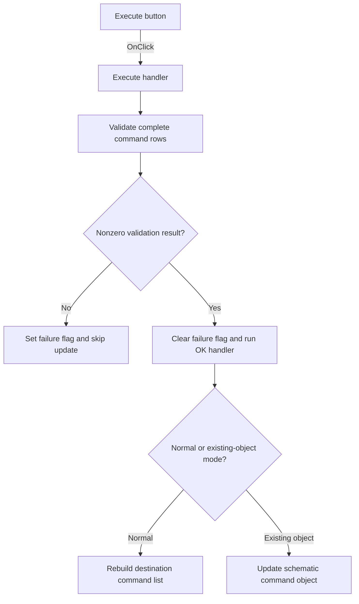

# Execute

> Analysis status: Individually reviewed from recovered source.

## Control

| Property | Recovered value |
| --- | --- |
| Form | SpiceCommandEditor |
| Component path | SpiceCommandEditor.pnlButtons.btnExecute |
| Control class | TBitBtn |
| Caption | Execute |
| Hint | Not present in the recovered resource. |
| Text | Not present in the recovered resource. |
| Handler name | btnExecuteClick |
| Handler address | 014725f0 |
| Graph node | `resource:dfm:SpiceCommandEditor/SpiceCommandEditor.pnlButtons.btnExecute` |
| Handler node | `function:014725f0` |
| Graph layer | UI |

## What happens when clicked

The handler runs the shared SPICE-command validation routine and stores the inverse result in form flag `+0x741`. A nonzero result then invokes the OK handler, which either rebuilds the destination command list or updates the existing schematic command object according to form mode `+0x740`. A zero result skips that update. The button has recovered modal result 6; the form close-query handler allows that close only when flag `+0x741` is false. In the recovered validator, the normal return value is initialized to 1 and is not reassigned. Parser exceptions or internal diagnostics can still interrupt that path, but their user-visible presentation is not recovered here.

## Click flow

## Handler evidence

- Source: [DecompiledSources/Tina16/functions/00000000014725F0__FUN_014725f0.c](../../../DecompiledSources/Tina16/functions/00000000014725F0__FUN_014725f0.c)
- Recovered role: Validates command rows before applying and closing the editor.
- Current graph summary: Handles 1 Delphi UI event: SpiceCommandEditor.pnlButtons.btnExecute.OnClick.
- Current graph behavior: Stores the inverse validation result, applies the OK path only for a nonzero result, and cooperates with the form close-query guard for modal result 6.
- Current graph evidence: FUN_014725f0 calls 014736b0, writes `result == 0` to form `+0x741`, and calls 01472630 only when the result is nonzero. FUN_01472b70 checks this flag when the form modal result is 6.
- Complexity: moderate
- Distinct outgoing calls: 2

## Direct calls

- `function:01472630` — rebuilds the destination list or delegates to the schematic-update path according to form mode.
- `function:014736b0` — assembles complete grid rows and submits them to the recovered SPICE parser path.

## Resource evidence

- Kind: Not present in the recovered resource.
- Modal result: 6
- Checked state: Not present in the recovered resource.
- List items: Not present in the recovered resource.
- Image reference: Not present in the recovered resource.
- Extracted glyph: [`0483_SpiceCommandEditor_SpiceCommandEditor_pnlButtons_btnExecute_Glyph_Data.png`](../../../glyph/0483_SpiceCommandEditor_SpiceCommandEditor_pnlButtons_btnExecute_Glyph_Data.png)

## Nearby label candidates

Nearby labels are layout candidates only. They are not proof of behavior.

- No same-parent label candidate is available.

## Analysis limits

- The green triangle glyph agrees with the Execute caption, but the handler and validator sources establish the behavior.
- The validator's normal recovered return is always 1. The exact parser error-reporting mechanism and any exception path remain unknown.
