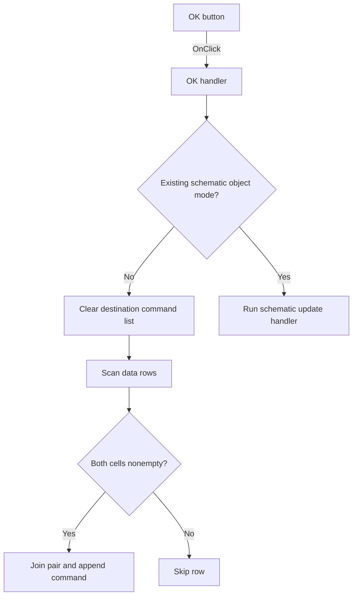

# btnOK

> Analysis status: Individually reviewed from recovered source.

## Control

| Property | Recovered value |
| --- | --- |
| Form | SpiceCommandEditor |
| Component path | SpiceCommandEditor.pnlButton1.btnOK |
| Control class | TBitBtn |
| Caption | Not present in the recovered resource. |
| Hint | Not present in the recovered resource. |
| Text | Not present in the recovered resource. |
| Handler name | btnOKClick |
| Handler address | 01472630 |
| Graph node | `resource:dfm:SpiceCommandEditor/SpiceCommandEditor.pnlButton1.btnOK` |
| Handler node | `function:01472630` |
| Graph layer | UI |

## What happens when clicked

The handler uses form mode flag `+0x740`. In normal mode, it clears the destination string list at `+0x728`, scans the grid from `FixedRows` through `RowCount - 1`, and keeps only rows whose two cells are both nonempty. It joins each accepted pair with a fixed recovered separator and appends the result to the destination list. Empty or incomplete rows are skipped. In existing-object mode, it delegates to the Add to schematic handler, which applies the complete rows to the selected schematic command object. The recovered handler has no validation or rollback. The button's `bkOK` kind provides the modal acceptance behavior outside this function.

## Click flow

## Handler evidence

- Source: [DecompiledSources/Tina16/functions/0000000001472630__FUN_01472630.c](../../../DecompiledSources/Tina16/functions/0000000001472630__FUN_01472630.c)
- Recovered role: Accepts complete command rows into a list or an existing schematic object.
- Current graph summary: Handles 1 Delphi UI event: SpiceCommandEditor.pnlButton1.btnOK.OnClick.
- Current graph behavior: Rebuilds the destination list from complete grid rows in normal mode, or delegates to the schematic-object update path in existing-object mode.
- Current graph evidence: FUN_01472630 branches on form byte `+0x740`, clears the object at `+0x728`, reads grid columns 0 and 1 for each data row, appends joined nonempty pairs through virtual slot `+0x78`, or calls 014727e0.
- Complexity: complex
- Distinct outgoing calls: 4

## Direct calls

- `function:00414560` — finalizes the five temporary UnicodeString values.
- `function:00416cd0` — formats the two cell strings with the fixed recovered separator.
- `function:0084e320` — reads text from one grid cell.
- `function:014727e0` — applies the complete command rows to a new or existing schematic command object.

## Resource evidence

- Kind: bkOK
- Modal result: Not present in the recovered resource.
- Checked state: Not present in the recovered resource.
- List items: Not present in the recovered resource.
- Image reference: Not present in the recovered resource.
- Extracted glyph: None.

## Nearby label candidates

Nearby labels are layout candidates only. They are not proof of behavior.

- No same-parent label candidate is available.

## Analysis limits

- The fixed separator data at `LAB_014727d8` is not decoded in the exported source, so its exact text remains unknown.
- The source does not validate the command syntax and does not save the circuit.
