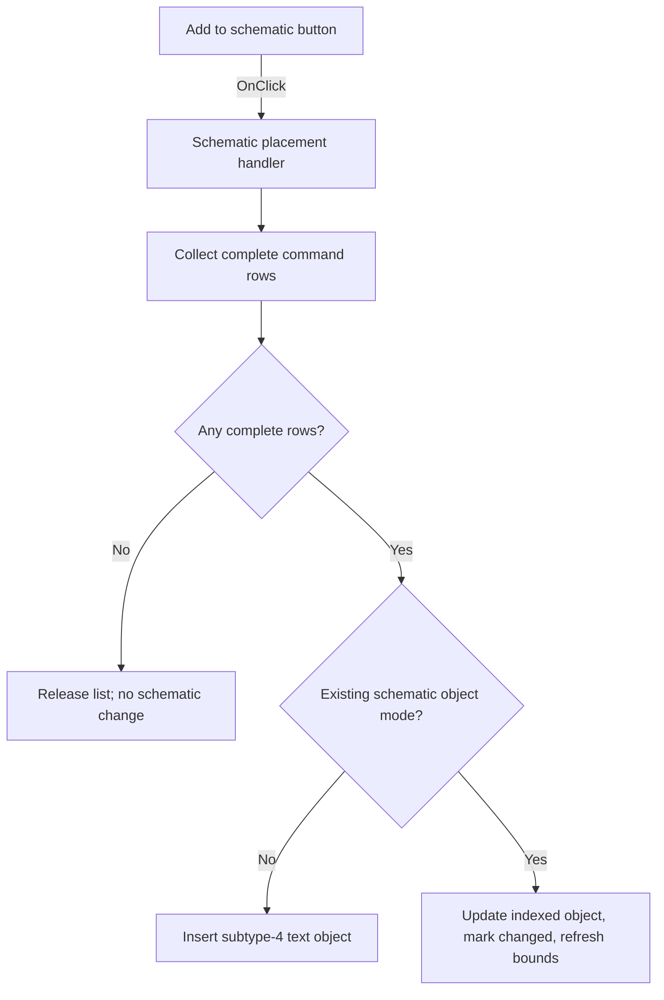

# Add to schematic

> Analysis status: Individually reviewed from recovered source.

## Control

| Property | Recovered value |
| --- | --- |
| Form | SpiceCommandEditor |
| Component path | SpiceCommandEditor.pnlButtons.btnPlace |
| Control class | TButton |
| Caption | Add to schematic |
| Hint | Not present in the recovered resource. |
| Text | Not present in the recovered resource. |
| Handler name | btnPlaceClick |
| Handler address | 014727e0 |
| Graph node | `resource:dfm:SpiceCommandEditor/SpiceCommandEditor.pnlButtons.btnPlace` |
| Handler node | `function:014727e0` |
| Graph layer | UI |

## What happens when clicked

The handler creates a temporary string list, clears it, and scans all data rows. It adds only rows whose command and value cells are both nonempty, joining each pair with a fixed recovered separator. If the list is empty, it releases the temporary list without changing the schematic. In normal mode (`+0x740` is false), a nonempty list is inserted as a new schematic text object with subtype 4, the form's font, and the current schematic position. In existing-object mode, the handler finds the object at the index saved in `+0x744`, copies the list into it, marks the schematic changed, obtains its bounds, and asks the active view to refresh that area. The button has recovered modal result 8, but the handler itself does not save the circuit or provide rollback.

## Click flow

## Handler evidence

- Source: [DecompiledSources/Tina16/functions/00000000014727E0__FUN_014727e0.c](../../../DecompiledSources/Tina16/functions/00000000014727E0__FUN_014727e0.c)
- Recovered role: Inserts or updates a schematic command text object from complete grid rows.
- Current graph summary: Handles 1 Delphi UI event: SpiceCommandEditor.pnlButtons.btnPlace.OnClick.
- Current graph behavior: Builds a command list from complete rows, inserts a subtype-4 schematic text object in normal mode, or updates and refreshes the indexed existing object in edit mode.
- Current graph evidence: FUN_014727e0 reads grid cells through 0084e320, appends formatted pairs to a temporary list, tests its count, branches on `+0x740`, calls 01c9c910 with subtype 4, or gets collection item `+0x744`, copies content, calls 0199e310, reads bounds, and invokes the active-view refresh method.
- Complexity: complex
- Distinct outgoing calls: 9

## Direct calls

- `function:00410f20` — destroys the temporary string-list object safely.
- `function:00414560` — finalizes the temporary UnicodeString values.
- `function:00416cd0` — formats one command from its two cell values and the fixed separator.
- `function:004b6930` — creates the temporary Delphi string list.
- `function:0084e320` — reads text from one grid cell.
- `function:00b94e60` — retrieves the existing schematic object by the saved index.
- `function:0149ec30` — copies the prepared command list into the schematic text object.
- `function:0199e310` — marks the active schematic changed and notifies relevant views.
- `function:01c9c910` — creates and inserts a subtype-4 text object into the active schematic.

## Resource evidence

- Kind: Not present in the recovered resource.
- Modal result: 8
- Checked state: Not present in the recovered resource.
- List items: Not present in the recovered resource.
- Image reference: Not present in the recovered resource.
- Extracted glyph: None.

## Nearby label candidates

Nearby labels are layout candidates only. They are not proof of behavior.

- No same-parent label candidate is available.

## Analysis limits

- The fixed separators at `LAB_01472a88` and related data are not decoded in the exported source.
- The exact user-visible undo behavior of the insertion helper and the existing-object refresh method names remain unknown.
