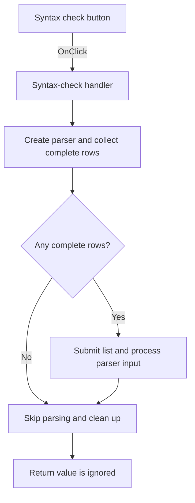

# Syntax check

> Analysis status: Individually reviewed from recovered source.

## Control

| Property | Recovered value |
| --- | --- |
| Form | SpiceCommandEditor |
| Component path | SpiceCommandEditor.pnlButtons.btnSyntaxCheck |
| Control class | TButton |
| Caption | Syntax check |
| Hint | Not present in the recovered resource. |
| Text | Not present in the recovered resource. |
| Handler name | btnSyntaxCheckClick |
| Handler address | 01472a90 |
| Graph node | `resource:dfm:SpiceCommandEditor/SpiceCommandEditor.pnlButtons.btnSyntaxCheck` |
| Handler node | `function:01472a90` |
| Graph layer | UI |

## What happens when clicked

The click handler calls the shared validation routine and ignores its Boolean return. That routine creates and initializes a temporary SPICE parser context, collects only grid rows whose two cells are both nonempty, and submits a nonempty command list to the parser path. It repeatedly processes parser input until the recovered normalized parser state matches a fixed sentinel, then restores the parser flag and destroys all temporary objects. An empty list skips parsing. The recovered normal return is initialized to 1 and is never reassigned. The exported source does not prove how parser diagnostics or exceptions are shown to the user.

## Click flow

## Handler evidence

- Source: [DecompiledSources/Tina16/functions/0000000001472A90__FUN_01472a90.c](../../../DecompiledSources/Tina16/functions/0000000001472A90__FUN_01472a90.c)
- Recovered role: Runs SPICE command validation without applying the commands.
- Current graph summary: Handles 1 Delphi UI event: SpiceCommandEditor.pnlButtons.btnSyntaxCheck.OnClick.
- Current graph behavior: Delegates to the shared command validator and ignores its result.
- Current graph evidence: FUN_01472a90 contains only a call to 014736b0 and a return. FUN_014736b0 constructs and initializes a parser context, builds a list from complete grid rows, processes nonempty input, cleans up, and returns its unchanged local value 1.
- Complexity: simple
- Distinct outgoing calls: 1

## Direct calls

- `function:014736b0` — assembles complete rows and submits them to the recovered SPICE parser path.

## Resource evidence

- Kind: Not present in the recovered resource.
- Modal result: Not present in the recovered resource.
- Checked state: Not present in the recovered resource.
- List items: Not present in the recovered resource.
- Image reference: Not present in the recovered resource.
- Extracted glyph: None.

## Nearby label candidates

Nearby labels are layout candidates only. They are not proof of behavior.

- No same-parent label candidate is available.

## Analysis limits

- The fixed parser sentinel at `DAT_01473a38` and the exact error-presentation path are not decoded in the exported source.
- This handler does not copy commands to the destination list and does not modify a schematic object.
