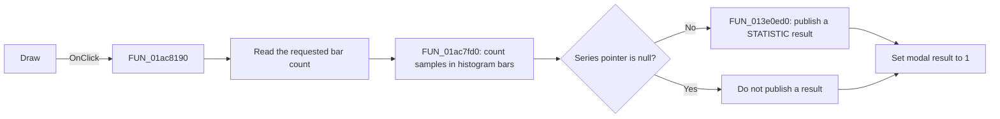

# Draw

> Analysis status: Reviewed from recovered source and UI evidence.

## Control

| Property | Recovered value |
| --- | --- |
| Form | StatisticDlg |
| Component path | StatisticDlg.DrawBtn |
| Control class | TBitBtn |
| Caption | Draw |
| Hint | Not present in the recovered resource. |
| Text | Not present in the recovered resource. |
| Handler name | DrawBtnClick |
| Handler address | 01ac8190 |
| Graph node | `resource:dfm:StatisticDlg/StatisticDlg.DrawBtn` |
| Handler node | `function:01ac8190` |
| Graph layer | UI |

## What happens when clicked

The handler reads the requested bar count from `BarCntSE`. It passes that count, the calculated sample array, the selected sample range, and the saved minimum and maximum values to `FUN_01ac7fd0`. That function allocates a 16-bit count for each bar. It assigns every selected sample to a bar, creates the histogram points, and adds a final zero-count point at the maximum value.

`FUN_013e0ed0` publishes the returned series as a new `STATISTIC` analysis result. The result uses `Values` and `Samples` as its axis text. The handler then sets the form modal result to `1`, so the dialog closes after the draw request. If the series pointer is null, the publish helper makes no result, but the handler still closes the dialog.

The recovered path does not check for a zero bar count or for equal minimum and maximum values before it divides by the bar width. The behavior of those invalid inputs is therefore not established by this handler.

## Click flow

## Handler evidence

- Source: [DecompiledSources/Tina16/functions/0000000001AC8190__FUN_01ac8190.c](../../../DecompiledSources/Tina16/functions/0000000001AC8190__FUN_01ac8190.c)
- Recovered role: Build and publish a histogram from the calculated StatisticDlg samples.
- Current graph summary: Handles 1 Delphi UI event: StatisticDlg.DrawBtn.OnClick.
- Current graph behavior: Reads the bar count, builds the histogram series, publishes it as a statistic result, and closes the dialog.
- Current graph evidence: The handler passes the sample array, range, minimum, maximum, and bar count to `FUN_01ac7fd0`; then it passes the returned series to `FUN_013e0ed0` and writes `1` to form offset `+0x508`.
- Complexity: complex
- Distinct outgoing calls: 3

## Direct calls

- `function:00c5a450` — FUN_00c5a450
- `function:013e0ed0` — FUN_013e0ed0
- `function:01ac7fd0` — FUN_01ac7fd0

## Resource evidence

- Kind: Not present in the recovered resource.
- Modal result: Not present in the recovered resource.
- Checked state: Not present in the recovered resource.
- List items: Not present in the recovered resource.
- Image reference: Not present in the recovered resource.
- Extracted glyph: None.

## Nearby label candidates

Nearby labels are layout candidates only. They are not proof of behavior.

- Rank 1: tmpLabel at distance 7.
- Rank 2: &Number of bars at distance 238.
- Rank 3: &Output at distance 290.

## Analysis limits

- The recovered code does not identify how the spin control constrains the bar count before this handler runs.
- The exact Delphi class names for the histogram series and result window are not recovered.
