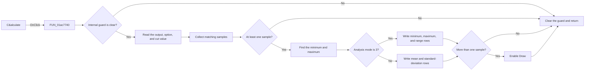

# C&alculate

> Analysis status: Reviewed from recovered source and UI evidence.

## Control

| Property | Recovered value |
| --- | --- |
| Form | StatisticDlg |
| Component path | StatisticDlg.OKBtn |
| Control class | TBitBtn |
| Caption | C&alculate |
| Hint | Not present in the recovered resource. |
| Text | Not present in the recovered resource. |
| Handler name | OKBtnClick |
| Handler address | 01ac7740 |
| Graph node | `resource:dfm:StatisticDlg/StatisticDlg.OKBtn` |
| Handler node | `function:01ac7740` |
| Graph layer | UI |

## What happens when clicked

The handler reads the current value from `CutEdit` and the selected output from `OutputSelectorCB`. It shows the lower result panel and searches the form's output collection for records that match the selected output. `FUN_01ac7590` counts the matching records, allocates the sample array, and records whether the matched output has a special state.

If no record matches, the handler does not calculate statistics. If records match, `FUN_01ac5e20` reads one value from each record. The selected `OptionRG` item chooses the value path for `XMAX`, `YMAX`, `CUT`, `XMIN`, or `YMIN`. `FUN_01ac6150` finds the minimum and maximum values.

The handler fills `StringGrid` according to a global analysis-mode byte. Mode `3` writes minimum, maximum, and range values. Other modes write the mean and population standard deviation. For a matched output with the special state, it also writes the cut value and its differences from the maximum and minimum. It enables `DrawBtn` only when more than one sample is available. A temporary progress object is destroyed after the calculation.

An internal byte at form offset `+0x759` can skip the calculation path. Its purpose and its setter are not recovered here. The handler clears that byte before it returns. The recovered handler has no explicit error-message path.

## Click flow

## Handler evidence

- Source: [DecompiledSources/Tina16/functions/0000000001AC7740__FUN_01ac7740.c](../../../DecompiledSources/Tina16/functions/0000000001AC7740__FUN_01ac7740.c)
- Recovered role: Calculate the selected tolerance-output statistics and update the result grid.
- Current graph summary: Handles 1 Delphi UI event: StatisticDlg.OKBtn.OnClick.
- Current graph behavior: Collects values for the selected output and statistic option, calculates summary values, fills the result grid, and enables histogram drawing when enough samples exist.
- Current graph evidence: The handler reads controls at form offsets `+0x6e8`, `+0x6f0`, and `+0x700`; calls `FUN_01ac7590`, `FUN_01ac5e20`, and `FUN_01ac6150`; writes grid cells through `FUN_0084e3e0`; and enables the control at `+0x6c8` only when the sample count is greater than one.
- Complexity: complex
- Distinct outgoing calls: 19

## Direct calls

- `function:00410f20` — Nil-safe Delphi object destruction helper
- `function:00414480` — Delphi UnicodeString clear and finalization helper
- `function:00414560` — Delphi UnicodeString array finalization helper
- `function:0064dbe0` — FUN_0064dbe0
- `function:007fc180` — FUN_007fc180
- `function:008059a0` — FUN_008059a0
- `function:00848a70` — FUN_00848a70
- `function:0084e3e0` — FUN_0084e3e0
- `function:00b89270` — FUN_00b89270
- `function:00b8e520` — FUN_00b8e520
- `function:00b90090` — FUN_00b90090
- `function:00c54370` — FUN_00c54370
- `function:01ac5d40` — FUN_01ac5d40
- `function:01ac5da0` — FUN_01ac5da0
- `function:01ac5e20` — FUN_01ac5e20
- `function:01ac6150` — FUN_01ac6150
- `function:01ac70b0` — FUN_01ac70b0
- `function:01ac7590` — FUN_01ac7590
- `function:01b1d750` — FUN_01b1d750

## Resource evidence

- Kind: Not present in the recovered resource.
- Modal result: Not present in the recovered resource.
- Checked state: Not present in the recovered resource.
- List items: Not present in the recovered resource.
- Image reference: Not present in the recovered resource.
- Extracted glyph: None.

## Nearby label candidates

Nearby labels are layout candidates only. They are not proof of behavior.

- Rank 1: tmpLabel at distance 103.
- Rank 2: &Output at distance 214.
- Rank 3: &Number of bars at distance 334.

## Analysis limits

- The semantic name of the global analysis mode is not recovered.
- The exact meaning of the matched-output state byte is not recovered. The article describes only how it changes the displayed rows.
- The internal guard at form offset `+0x759` has no recovered setter in this handler.
