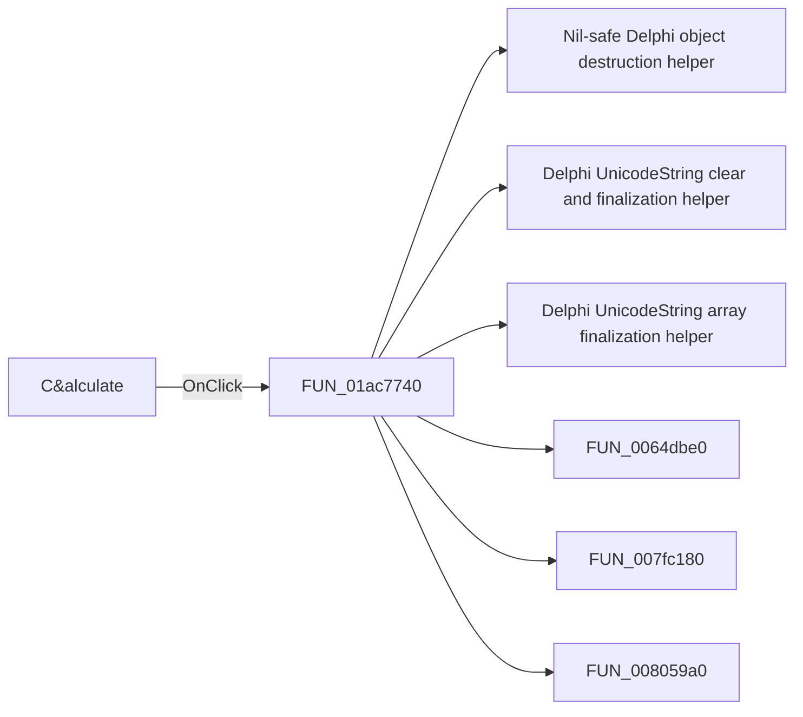

# C&alculate

> Analysis status: Pending individual source review.

## Control

| Property | Recovered value |
| --- | --- |
| Form | StatisticDlg |
| Component path | StatisticDlg.OKBtn |
| Control class | TBitBtn |
| Caption | C&alculate |
| Hint | Not present in the recovered resource. |
| Text | Not present in the recovered resource. |
| Handler name | OKBtnClick |
| Handler address | 01ac7740 |
| Graph node | `resource:dfm:StatisticDlg/StatisticDlg.OKBtn` |
| Handler node | `function:01ac7740` |
| Graph layer | UI |

## What happens when clicked

Pending individual analysis. An agent must read the recovered handler source and its relevant callees before it replaces this text.

## Click flow

## Handler evidence

- Source: [DecompiledSources/Tina16/functions/0000000001AC7740__FUN_01ac7740.c](../../../DecompiledSources/Tina16/functions/0000000001AC7740__FUN_01ac7740.c)
- Recovered role: Not present in the recovered resource.
- Current graph summary: Handles 1 Delphi UI event: StatisticDlg.OKBtn.OnClick.
- Current graph behavior: Not present in the recovered resource.
- Current graph evidence: Not present in the recovered resource.
- Complexity: complex
- Distinct outgoing calls: 19

## Direct calls

- `function:00410f20` — Nil-safe Delphi object destruction helper
- `function:00414480` — Delphi UnicodeString clear and finalization helper
- `function:00414560` — Delphi UnicodeString array finalization helper
- `function:0064dbe0` — FUN_0064dbe0
- `function:007fc180` — FUN_007fc180
- `function:008059a0` — FUN_008059a0
- `function:00848a70` — FUN_00848a70
- `function:0084e3e0` — FUN_0084e3e0
- `function:00b89270` — FUN_00b89270
- `function:00b8e520` — FUN_00b8e520
- `function:00b90090` — FUN_00b90090
- `function:00c54370` — FUN_00c54370
- `function:01ac5d40` — FUN_01ac5d40
- `function:01ac5da0` — FUN_01ac5da0
- `function:01ac5e20` — FUN_01ac5e20
- `function:01ac6150` — FUN_01ac6150
- `function:01ac70b0` — FUN_01ac70b0
- `function:01ac7590` — FUN_01ac7590
- `function:01b1d750` — FUN_01b1d750

## Resource evidence

- Kind: Not present in the recovered resource.
- Modal result: Not present in the recovered resource.
- Checked state: Not present in the recovered resource.
- List items: Not present in the recovered resource.
- Image reference: Not present in the recovered resource.
- Extracted glyph: None.

## Nearby label candidates

Nearby labels are layout candidates only. They are not proof of behavior.

- Rank 1: tmpLabel at distance 103.
- Rank 2: &Output at distance 214.
- Rank 3: &Number of bars at distance 334.

## Analysis limits

- Do not infer behavior from the control class, caption, hint, glyph, or nearby label alone.
- Do not replace the pending status until the handler source and relevant call path provide enough evidence.
