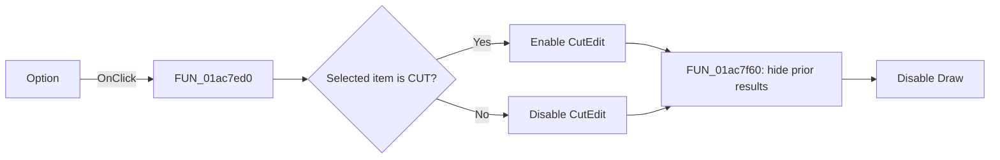

#  Option

> Analysis status: Reviewed from recovered source and UI evidence.

## Control

| Property | Recovered value |
| --- | --- |
| Form | StatisticDlg |
| Component path | StatisticDlg.OptionRG |
| Control class | TRadioGroup |
| Caption |  Option  |
| Hint | Not present in the recovered resource. |
| Text | Not present in the recovered resource. |
| Handler name | OptionRGClick |
| Handler address | 01ac7ed0 |
| Graph node | `resource:dfm:StatisticDlg/StatisticDlg.OptionRG` |
| Handler node | `function:01ac7ed0` |
| Graph layer | UI |

## What happens when clicked

The handler reads the selected `OptionRG` item. Item index `2` is `CUT` in the recovered resource. It enables `CutEdit` only for that item. It disables `CutEdit` for `XMAX`, `YMAX`, `XMIN`, and `YMIN`.

The handler then calls `FUN_01ac7f60` to invalidate the current results. That function hides the lower result panel, reduces the form height when the panel was active, and disables `DrawBtn`. The user must calculate again before drawing a histogram for the new option. The path has no error branch.

## Click flow

## Handler evidence

- Source: [DecompiledSources/Tina16/functions/0000000001AC7ED0__FUN_01ac7ed0.c](../../../DecompiledSources/Tina16/functions/0000000001AC7ED0__FUN_01ac7ed0.c)
- Recovered role: Update cut-value input availability and invalidate calculated results.
- Current graph summary: Handles 1 Delphi UI event: StatisticDlg.OptionRG.OnClick.
- Current graph behavior: Enables the cut-value editor only for the `CUT` option, then hides stale results and disables drawing.
- Current graph evidence: The handler compares `OptionRG.ItemIndex` at component offset `+0x4a8` with `2`, writes the enabled state through the control at form offset `+0x700`, and calls `FUN_01ac7f60`; that callee hides the panel at `+0x710` and disables the control at `+0x6c8`.
- Complexity: simple
- Distinct outgoing calls: 1

## Direct calls

- `function:01ac7f60` — FUN_01ac7f60

## Resource evidence

- Kind: Not present in the recovered resource.
- Modal result: Not present in the recovered resource.
- Checked state: Not present in the recovered resource.
- List items: ("&XMAX", "&YMAX", "C&UT", "X&MIN", "YM&IN")
- Image reference: Not present in the recovered resource.
- Extracted glyph: None.

## Nearby label candidates

Nearby labels are layout candidates only. They are not proof of behavior.

- Rank 1: &Output at distance 27.
- Rank 2: &Number of bars at distance 95.
- Rank 3: tmpLabel at distance 276.

## Analysis limits

- Recovered field offsets, UI resource roles, and use by the related handlers identify `CutEdit`, the result panel, and `DrawBtn`. Their original Delphi field declarations are not present.
- No glyph evidence exists for this control.
