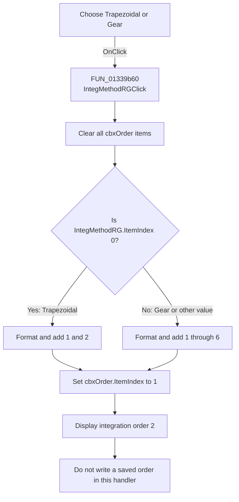

#  Integration method

> Analysis status: Recovered integration-order list update reviewed.

## Control

| Property | Recovered value |
| --- | --- |
| Form | SteadyStateAnalDlg |
| Component path | SteadyStateAnalDlg.TransientOptions.IntegMethodRG |
| Control class | TRadioGroup |
| Caption |  Integration method  |
| Hint | Not present in the recovered resource. |
| Text | Not present in the recovered resource. |
| Handler name | IntegMethodRGClick |
| Handler address | 01339b60 |
| Graph node | `resource:dfm:SteadyStateAnalDlg/SteadyStateAnalDlg.TransientOptions.IntegMethodRG` |
| Handler node | `function:01339b60` |
| Graph layer | UI |

## What happens when clicked

`IntegMethodRGClick` rebuilds the adjacent `cbxOrder` list each time the
integration-method selection changes. The handler first clears the combo's
Items collection. It then reads `IntegMethodRG.ItemIndex`:

- Index 0, **Trapezoidal**, adds the decimal strings `1` and `2`.
- Any nonzero index, normally index 1 for **Gear**, adds `1` through `6`.

After either branch, the handler sets `cbxOrder.ItemIndex` to 1. Combo indexes
are zero-based, so the visible selection becomes integration order `2`.
Changing the method therefore discards the prior order selection and resets it
to 2.

`FormCreate` restores the saved method index and then calls this handler. It
does not restore a later order selection. The recovered OK handler also does
not read `cbxOrder`. Thus this click changes the displayed order list and its
selection, but the recovered form path does not store that selection. It does
not start an analysis, run an integration algorithm, or show an error.

## Click flow

## Handler evidence

- Source: [DecompiledSources/Tina16/functions/0000000001339B60__FUN_01339b60.c](../../../DecompiledSources/Tina16/functions/0000000001339B60__FUN_01339b60.c)
- Recovered role: Rebuilds the permitted integration-order choices for the
  selected transient integration method.
- Current graph summary: Handles 1 Delphi UI event: SteadyStateAnalDlg.TransientOptions.IntegMethodRG.OnClick.
- Current graph behavior: Clears `cbxOrder`, adds orders 1 through 2 or 1
  through 6, and selects the second item.
- Current graph evidence: The handler reads the radio-group ItemIndex at form
  field `+0x6f8`, uses the Items object from the combo at form field `+0x748`,
  formats each loop integer with `FUN_0043f750`, and calls the combo ItemIndex
  setter with 1.
- Complexity: moderate
- Distinct outgoing calls: 2

## Direct calls

- `function:00414560` — finalizes the two temporary UnicodeString slots.
- `function:0043f750` — formats each integer as a Unicode decimal string before
  the Items collection copies it.

## Resource evidence

- Kind: Not present in the recovered resource.
- Modal result: Not present in the recovered resource.
- Checked state: Not present in the recovered resource.
- List items: ("&Trapezoidal", "&Gear")
- Image reference: Not present in the recovered resource.
- Extracted glyph: None.

## Nearby label candidates

Nearby labels are layout candidates only. They are not proof of behavior.

- Rank 1: Integration order at distance 55.
- Rank 2: Final &Accuracy at distance 117.
- Rank 3: &Final checking time at distance 142.

## Analysis limits

- The source proves the displayed list and selection. It does not show the
  solver that interprets Trapezoidal, Gear, or an integration order.
- Every value other than index 0 uses the six-item branch. The handler has no
  separate guard for an unexpected index.
- The nearby `Integration order` label is relevant because the handler accesses
  the adjacent `cbxOrder` control directly. Proximity alone is not the proof.
