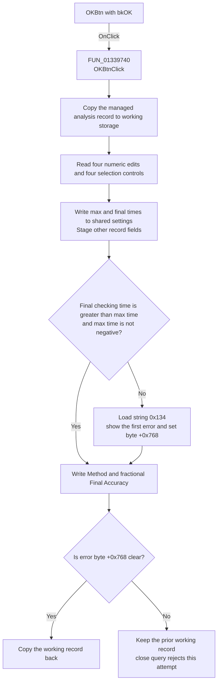

# OKBtn

> Analysis status: Recovered handler, validation, state writes, and close-block behavior reviewed.

## Control

| Property | Recovered value |
| --- | --- |
| Form | SteadyStateAnalDlg |
| Component path | SteadyStateAnalDlg.OKBtn |
| Control class | TBitBtn |
| Caption | Not present in the recovered resource. |
| Hint | Not present in the recovered resource. |
| Text | Not present in the recovered resource. |
| Handler name | OKBtnClick |
| Handler address | 01339740 |
| Graph node | `resource:dfm:SteadyStateAnalDlg/SteadyStateAnalDlg.OKBtn` |
| Handler node | `function:01339740` |
| Graph layer | UI |

## What happens when clicked

`OKBtnClick` reads the steady-state analysis controls and applies their values to
two related state areas. It first copies the managed analysis record at
`form + 0x770 + 0x5d8` to a local working record. It then reads the four
floating-point edits for Start display, Max searching time, Final checking
time, and Final Accuracy.

The handler writes these values as follows:

- It puts Start display in working-record field `+0xe61`.
- It writes Max searching time and Final checking time to shared settings
  fields `+0xc0` and `+0xc8`.
- It converts the transient-control radio index to the stored byte at
  working-record field `+0xe16`.
- It writes the Draw excitation check state to working-record field `+0xe15`.
- It converts the Trapezoidal or Gear index to a one-based value at
  working-record field `+0xe14`.
- It writes the selected steady-state Method index to shared field `+0x120`.
- It divides the displayed Final Accuracy percentage by 100 and writes the
  fraction to shared field `+0x58`.

The range check requires Final checking time to be greater than Max searching
time. Max searching time can be zero, but it cannot be negative. If either rule
fails, the handler loads localized string `0x134` and calls
[`FUN_013396e0`](../../../DecompiledSources/Tina16/functions/00000000013396E0__FUN_013396e0.c).
That wrapper sends the message and form error byte `+0x768` to the shared
first-error reporter. The reporter shows one message and sets the byte.
`FormCloseQuery` then rejects the close request and clears the byte.

The Max searching time and Final checking time writes occur before the range
check. The Method and Final Accuracy writes also occur after that check,
including on its error branch. The handler copies the working record back only
when error byte `+0x768` is clear. Therefore, a failed range check blocks the
working-record changes, but it does not roll back the shared-setting writes.
The recovered handler does not read `cbxOrder`, so this click does not save the
displayed integration-order selection.

## Click flow

## Handler evidence

- Source: [DecompiledSources/Tina16/functions/0000000001339740__FUN_01339740.c](../../../DecompiledSources/Tina16/functions/0000000001339740__FUN_01339740.c)
- Recovered role: Validates and applies steady-state analysis settings.
- Current graph summary: Handles 1 Delphi UI event: SteadyStateAnalDlg.OKBtn.OnClick.
- Current graph behavior: Reads the analysis controls, validates the time
  relationship, writes shared solver settings, and commits the managed working
  record only while the form error byte is clear.
- Current graph evidence: The handler copies the record at `+0x770 + 0x5d8`,
  reads float-edit fields `+0x730`, `+0x708`, `+0x710`, and `+0x750`, checks
  shared fields `+0xc0` and `+0xc8`, writes record fields `+0xe14` through
  `+0xe16` and `+0xe61`, and tests error byte `+0x768` before the copy-back.
- Complexity: complex
- Distinct outgoing calls: 8

## Direct calls

- `function:00414480` — Delphi UnicodeString clear and finalization helper
- `function:00417580` — initializes the compiler-managed working record.
- `function:00417740` — finalizes the compiler-managed working record.
- `function:00417c40` — copies the managed record with recovered type data.
- `function:00b89270` — returns the application string-resource provider.
- `function:00b8e520` — loads localized validation string `0x134`.
- `function:00b90090` — reads and validates a `TFloatEdit` value.
- `function:013396e0` — forwards a validation message with form error byte
  `+0x768` to the shared first-error reporter.

## Resource evidence

- Kind: bkOK
- Modal result: Not present in the recovered resource.
- Checked state: Not present in the recovered resource.
- List items: Not present in the recovered resource.
- Image reference: Not present in the recovered resource.
- Extracted glyph: None.

## Nearby label candidates

Nearby labels are layout candidates only. They are not proof of behavior.

- No same-parent label candidate is available.

## Analysis limits

- The recovered source proves the stored offsets and conversions. It does not
  recover the original Delphi names of the working-record and shared-setting
  fields.
- The exact localized text for resource `0x134` is not present as plain text.
  Its invalid-range condition, message route, error flag, and close veto are
  recovered.
- The floating-point helper can reject an edit before the relationship check.
  The source does not prove which later writes run after a raised edit error.
- The handler does not show the solver that consumes these settings. This
  article does not infer numerical behavior from the control labels.
