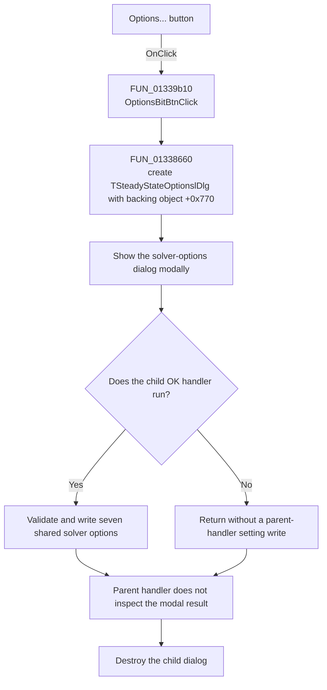

# Options...

> Analysis status: Recovered modal solver-options dialog path reviewed.

## Control

| Property | Recovered value |
| --- | --- |
| Form | SteadyStateAnalDlg |
| Component path | SteadyStateAnalDlg.OptionsBitBtn |
| Control class | TBitBtn |
| Caption | Options... |
| Hint | Not present in the recovered resource. |
| Text | Not present in the recovered resource. |
| Handler name | OptionsBitBtnClick |
| Handler address | 01339b10 |
| Graph node | `resource:dfm:SteadyStateAnalDlg/SteadyStateAnalDlg.OptionsBitBtn` |
| Handler node | `function:01339b10` |
| Graph layer | UI |

## What happens when clicked

`OptionsBitBtnClick` creates a `TSteadyStateOptionslDlg` and passes it the same
backing analysis object that the parent form keeps at offset `+0x770`. The
constructor stores that object at child-form offset `+0x780` and runs the
standard form initialization path.

The handler then calls the dialog's modal-show method. The child form's
`FormCreate` reads the shared steady-state solver options and fills its seven
numeric edits. If the user activates that dialog's OK button, its recovered
handler validates the edits and writes the accepted values to the shared
solver-options object. See the reviewed
[`SteadyStateOptionslDlg.OKBtn` article](../steadystateoptionsldlg/okbtn-69b3f2acbe.md).

When the modal call returns, the parent handler does not inspect its result. It
destroys the child dialog and returns. The parent handler has no direct setting
write, error message, validation branch, or analysis-start call.

## Click flow

## Handler evidence

- Source: [DecompiledSources/Tina16/functions/0000000001339B10__FUN_01339b10.c](../../../DecompiledSources/Tina16/functions/0000000001339B10__FUN_01339b10.c)
- Recovered role: Opens the steady-state solver-options dialog for the current
  backing analysis object.
- Current graph summary: Handles 1 Delphi UI event: SteadyStateAnalDlg.OptionsBitBtn.OnClick.
- Current graph behavior: Constructs the solver-options form, shows it
  modally, ignores the returned modal result, and destroys the form.
- Current graph evidence: `FUN_01339b10` passes the form field at `+0x770` to
  `FUN_01338660`, calls VMT slot `+0x2d0` on the returned object, and passes the
  same object to the nil-safe destruction helper.
- Complexity: moderate
- Distinct outgoing calls: 2

## Direct calls

- `function:00410f20` — Nil-safe Delphi object destruction helper
- `function:01338660` — constructs `TSteadyStateOptionslDlg`, stores the supplied
  backing object at child-form offset `+0x780`, and initializes the form.

## Resource evidence

- Kind: Not present in the recovered resource.
- Modal result: Not present in the recovered resource.
- Checked state: Not present in the recovered resource.
- List items: Not present in the recovered resource.
- Image reference: Not present in the recovered resource.
- Extracted glyph: None.

## Nearby label candidates

Nearby labels are layout candidates only. They are not proof of behavior.

- No same-parent label candidate is available.

## Analysis limits

- The parent handler ignores the modal result. The child form owns the actual
  setting writes through its own OK handler.
- The recovered source does not expose the original Delphi name or type of the
  backing object at parent offset `+0x770`.
- The `NumGlyphs` value is 2, but the recovered resource contains no glyph data
  for this control. No visual meaning is inferred from that value.
- The handler opens an editor only. It does not run the steady-state solver.
