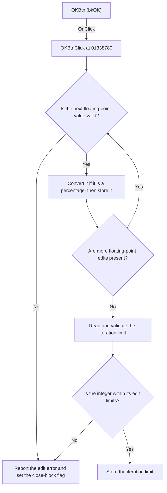

# OKBtn

> Analysis status: Reviewed from recovered source and graph evidence.

## Control

| Property | Recovered value |
| --- | --- |
| Form | SteadyStateOptionslDlg |
| Component path | SteadyStateOptionslDlg.OKBtn |
| Control class | TBitBtn |
| Caption | Not present in the recovered resource. |
| Hint | Not present in the recovered resource. |
| Text | Not present in the recovered resource. |
| Handler name | OKBtnClick |
| Handler address | 01338780 |
| Graph node | `resource:dfm:SteadyStateOptionslDlg/SteadyStateOptionslDlg.OKBtn` |
| Handler node | `function:01338780` |
| Graph layer | UI |

## What happens when clicked

The handler reads all seven steady-state solver inputs. It validates six floating-point edits and one integer edit through the edit controls' value getters. It stores Accuracy and Max. rel. increment as fractions, so it divides their displayed percentage values by 100. It stores Max. abs. voltage increment, Max. abs. current increment, State capacitor threshold, and State inductor threshold without conversion. It stores Iteration limit as an integer.

The writes go to the same shared solver-options object that `FormCreate` uses to fill the edits. The handler writes each value immediately after it reads that edit. If a later edit fails parsing or validation, the earlier values can already be changed because the handler has no recovered rollback for these writes.

The floating-point getter rejects values outside its general range and invokes the edit's validation callback when one is present. The integer getter checks the edit's configured minimum and maximum. These helpers raise an error for invalid input. The shared edit-error handler displays the first error and sets a form flag. `FormCloseQuery` then rejects the close request once and clears the flag. The OK handler has no separate success message.

## Click flow

## Handler evidence

- Source: [DecompiledSources/Tina16/functions/0000000001338780__FUN_01338780.c](../../../DecompiledSources/Tina16/functions/0000000001338780__FUN_01338780.c)
- Recovered role: Validates and applies the steady-state solver options.
- Current graph summary: Handles 1 Delphi UI event: SteadyStateOptionslDlg.OKBtn.OnClick.
- Current graph behavior: The handler reads seven numeric edits, converts two percentages to fractions, and writes the values to the shared steady-state solver-options object.
- Current graph evidence: `OKBtnClick` calls the floating-point getter for form offsets `0x6e0`, `0x6e8`, `0x708`, `0x720`, `0x738`, and `0x750`, calls the integer getter for offset `0x770`, and writes the results to shared-object offsets `0x50`, `0xf8`, `0x100` through `0x118`, and `0x68`. `FormCreate` performs the reverse mapping.
- Complexity: complex
- Distinct outgoing calls: 5

## Direct calls

- `function:00417580` — Initializes a compiler-managed record used by the handler.
- `function:00417740` — Finalizes the compiler-managed record before return.
- `function:00417c40` — Copies the managed record with its recovered type information.
- `function:00b90090` — Reads and validates a `TFloatEdit` value and raises an error for invalid input.
- `function:00f04d50` — Reads a `TIntEdit` value, checks its configured limits, and raises an error for invalid input.

## Resource evidence

- Kind: bkOK
- Modal result: Not present in the recovered resource.
- Checked state: Not present in the recovered resource.
- List items: Not present in the recovered resource.
- Image reference: Not present in the recovered resource.
- Extracted glyph: None.

## Nearby label candidates

Nearby labels are layout candidates only. They are not proof of behavior.

- No same-parent label candidate is available.

## Analysis limits

- The recovered source does not expose the configured validation limits or callbacks for each floating-point edit. Only the general floating-point guard and the edit-error route are recovered.
- The purpose of the large compiler-managed record copied around the edits is not recovered. The article does not assign it a solver role.
- The handler has no explicit close call. The resource identifies the button as `bkOK`, but it does not contain a separate modal-result value.
