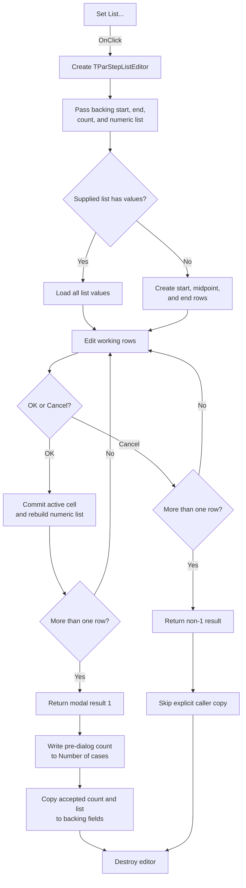

# Set List...

> Analysis status: Source reviewed. The modal editor inputs, accepted outputs, close guard, and caller update order are supported by recovered code.

## Control

| Property | Recovered value |
| --- | --- |
| Form | SteppingParametersFrame |
| Component path | SteppingParametersFrame.GroupBox1.btnListEdit |
| Control class | TButton |
| Caption | Set List... |
| Handler name | btnListEditClick |
| Handler address | 01438880 |
| Graph node | `resource:dfm:SteppingParametersFrame/SteppingParametersFrame.GroupBox1.btnListEdit` |
| Handler node | `function:01438880` |
| Graph layer | UI |

## What happens when clicked

[FUN_01438880](../../../DecompiledSources/Tina16/functions/0000000001438880__FUN_01438880.c) opens `TParStepListEditor` as a modal editor for an explicit parameter-stepping list.

The handler performs these operations:

1. It constructs the editor with the shared application owner.
2. It passes the frame’s backing start value, end value, 16-bit case count, and numeric-list reference to the editor.
3. It opens the editor modally and waits for the result.
4. If the modal result is `1`, it updates the frame’s backing count and list reference.
5. It destroys the temporary editor for every modal result.

The inputs come from backing fields `+0xA3D`, `+0xA45`, `+0xA4D`, and `+0xA50`. The handler does not read the visible Start value, End value, or Number of cases controls before it opens the editor. Text that the user changed but did not yet commit through the parent dialog is therefore not used for this editor session.

When the editor opens, it loads every supplied list value. A nil or empty list creates three working rows: start, midpoint, and end. The editor can add values, remove the last value, or clear all values. Add New stops at 1,000 rows.

Any close request is allowed only when the working count is greater than one. With zero or one row, OK and Cancel both leave the editor open, and the close-query handler shows no message. The editor does not check ordering, duplicates, or an individual numeric range.

On OK, the editor commits the active grid cell, rebuilds the numeric list from all working rows, and stores the row count as its output count. The caller then enters its result-`1` branch.

The accepted caller branch has an important order:

1. It writes the frame’s pre-dialog count to the visible **Number of cases** edit.
2. It then copies the editor’s accepted count and list reference to the frame backing fields.

There is no later visible-count write in this handler. The backing count becomes the accepted count, but this source does not prove that the visible count text changes to that new value here.

A normal Cancel result skips the explicit count and list copy. Grid-only edits are not serialized on Cancel. However, an attempted OK rebuilds an existing supplied list before the close query runs. If that OK is vetoed for fewer than two rows, the shared list object can already contain the short list even though the caller has not accepted a modal result.

## Click flow

## Handler evidence

- Click handler: [FUN_01438880](../../../DecompiledSources/Tina16/functions/0000000001438880__FUN_01438880.c)
- Editor constructor: [FUN_01437450](../../../DecompiledSources/Tina16/functions/0000000001437450__FUN_01437450.c)
- Editor input copy: [FUN_01437560](../../../DecompiledSources/Tina16/functions/0000000001437560__FUN_01437560.c)
- Editor initialization: [FUN_014375b0](../../../DecompiledSources/Tina16/functions/00000000014375B0__FUN_014375b0.c)
- Accepted list rebuild: [FUN_014377e0](../../../DecompiledSources/Tina16/functions/00000000014377E0__FUN_014377e0.c)
- Editor output copy: [FUN_01437590](../../../DecompiledSources/Tina16/functions/0000000001437590__FUN_01437590.c)
- Close guard: [FUN_01437bf0](../../../DecompiledSources/Tina16/functions/0000000001437BF0__FUN_01437bf0.c)
- Integer-edit writer: [FUN_00f04fa0](../../../DecompiledSources/Tina16/functions/0000000000F04FA0__FUN_00f04fa0.c)
- Recovered role: Edit and accept the explicit parameter-stepping value list.
- Complexity: complex.
- Distinct outgoing calls: 5.

## Direct calls

- `FUN_01437450` constructs `TParStepListEditor`.
- `FUN_01437560` seeds the editor with the current backing values.
- `FUN_00f04fa0` writes the pre-dialog count to `ParamPoints` on accepted return.
- `FUN_01437590` copies the editor’s output count and list reference to the frame.
- `FUN_00410f20` performs nil-safe object destruction.

## Resource evidence

- Parent group: **Parameter stepping**.
- Related controls: **Start value**, **End value**, **Number of cases**, and **Sweep type**.
- The List sweep item is the only selection that enables this button.
- The opened editor contains a numeric grid plus OK, Cancel, Add New, Remove Last, and Clear controls.
- Hint, action, image reference, and extracted glyph: None.

## Error and no-op behavior

- A permitted Cancel skips the caller’s explicit output-copy branch.
- Zero or one row prevents both OK and Cancel from closing the editor.
- The close guard shows no local error text.
- The editor has no range, ordering, or duplicate-value check in the traced path.
- Add New is a no-op at 1,000 rows.

## Analysis limits

- The original Delphi names of the backing record fields and numeric-list type are not recovered.
- The handler’s accepted update order proves that it writes the old count to the visible edit before it copies the new backing count. It does not prove a later automatic UI refresh.
- A vetoed OK can mutate a reused list object before modal acceptance. The recovered source does not provide rollback for that case.

