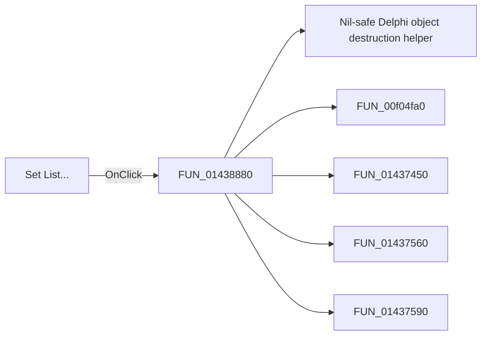

# Set List...

> Analysis status: Pending individual source review.

## Control

| Property | Recovered value |
| --- | --- |
| Form | SteppingParametersFrame |
| Component path | SteppingParametersFrame.GroupBox1.btnListEdit |
| Control class | TButton |
| Caption | Set List... |
| Hint | Not present in the recovered resource. |
| Text | Not present in the recovered resource. |
| Handler name | btnListEditClick |
| Handler address | 01438880 |
| Graph node | `resource:dfm:SteppingParametersFrame/SteppingParametersFrame.GroupBox1.btnListEdit` |
| Handler node | `function:01438880` |
| Graph layer | UI |

## What happens when clicked

Pending individual analysis. An agent must read the recovered handler source and its relevant callees before it replaces this text.

## Click flow

## Handler evidence

- Source: [DecompiledSources/Tina16/functions/0000000001438880__FUN_01438880.c](../../../DecompiledSources/Tina16/functions/0000000001438880__FUN_01438880.c)
- Recovered role: Not present in the recovered resource.
- Current graph summary: Handles 1 Delphi UI event: SteppingParametersFrame.GroupBox1.btnListEdit.OnClick.
- Current graph behavior: Not present in the recovered resource.
- Current graph evidence: Not present in the recovered resource.
- Complexity: complex
- Distinct outgoing calls: 5

## Direct calls

- `function:00410f20` — Nil-safe Delphi object destruction helper
- `function:00f04fa0` — FUN_00f04fa0
- `function:01437450` — FUN_01437450
- `function:01437560` — FUN_01437560
- `function:01437590` — FUN_01437590

## Resource evidence

- Kind: Not present in the recovered resource.
- Modal result: Not present in the recovered resource.
- Checked state: Not present in the recovered resource.
- List items: Not present in the recovered resource.
- Image reference: Not present in the recovered resource.
- Extracted glyph: None.

## Nearby label candidates

Nearby labels are layout candidates only. They are not proof of behavior.

- Rank 1: &Number of cases at distance 298.
- Rank 2: &End value at distance 323.
- Rank 3: St&art value at distance 365.

## Analysis limits

- Do not infer behavior from the control class, caption, hint, glyph, or nearby label alone.
- Do not replace the pending status until the handler source and relevant call path provide enough evidence.
