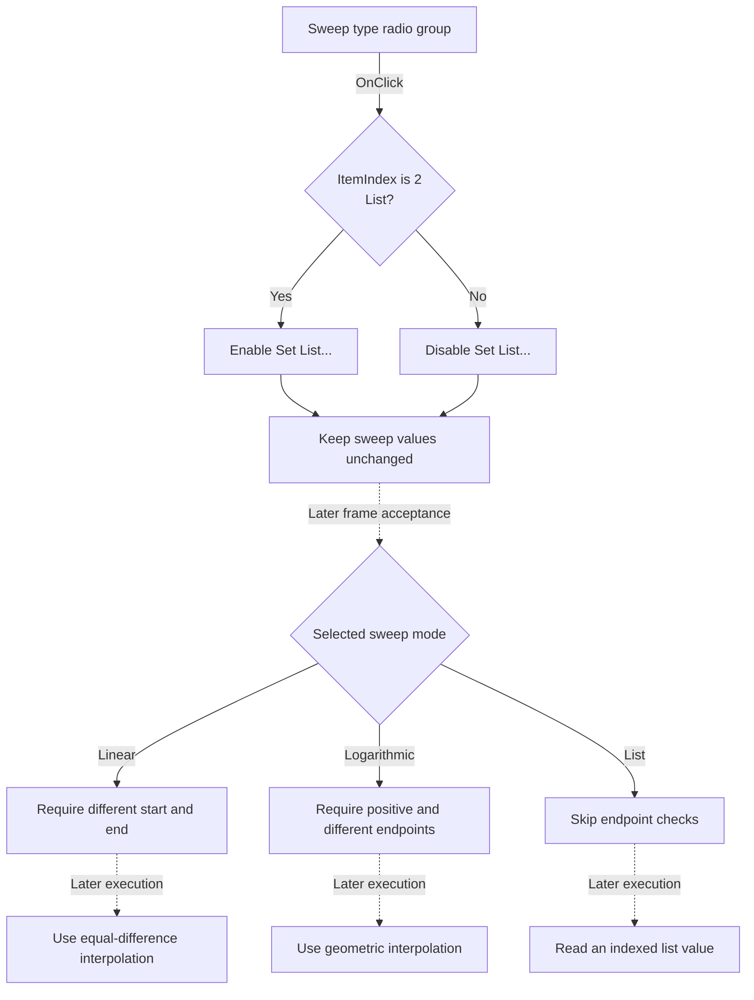

# Sweep type

> Analysis status: Source reviewed. The immediate button-state change, later validation, and sweep calculation are supported by recovered code.

## Control

| Property | Recovered value |
| --- | --- |
| Form | SteppingParametersFrame |
| Component path | SteppingParametersFrame.GroupBox1.ParamScaleRG |
| Control class | TRadioGroup |
| Caption | Sweep type |
| Handler name | ParamScaleRGClick |
| Handler address | 01438930 |
| Graph node | `resource:dfm:SteppingParametersFrame/SteppingParametersFrame.GroupBox1.ParamScaleRG` |
| Handler node | `function:01438930` |
| Graph layer | UI |

## What happens when clicked

`ParamScaleRG` selects the value source for parameter stepping. Its resource items are **Linear**, **Logarithmic**, and **List**, at indexes 0, 1, and 2.

[FUN_01438930](../../../DecompiledSources/Tina16/functions/0000000001438930__FUN_01438930.c) reads `ParamScaleRG.ItemIndex`. It enables **Set List...** only when the index is `2`:

- **List** enables **Set List...**.
- **Linear**, **Logarithmic**, an unselected value, or another index disables **Set List...**.

The click does not open the list editor. It does not change the start value, end value, number of cases, stored list, or active analysis. Repeating the same selection is a no-op in the VCL enabled-state setter.

The later frame-validation path reads the selected mode and applies these checks:

| Mode | Validation before commit | Later value source |
| --- | --- | --- |
| Linear, index 0 | Start and end must be different. | Equal-difference interpolation from start to end. |
| Logarithmic, index 1 | Start and end must both be positive and different. | Geometric interpolation from start to end. |
| List, index 2 | The frame skips the start/end checks. | Read the indexed value from the stored numeric list. |

[FUN_017c58f0](../../../DecompiledSources/Tina16/functions/00000000017C58F0__FUN_017c58f0.c) implements these three later calculation branches. The click handler itself does not run this function.

## Click and later-use flow

## Handler evidence

- Click handler: [FUN_01438930](../../../DecompiledSources/Tina16/functions/0000000001438930__FUN_01438930.c)
- Frame initialization: [FUN_014385d0](../../../DecompiledSources/Tina16/functions/00000000014385D0__FUN_014385d0.c)
- Frame read and validation: [FUN_014386d0](../../../DecompiledSources/Tina16/functions/00000000014386D0__FUN_014386d0.c)
- Common sweep calculation: [FUN_017c58f0](../../../DecompiledSources/Tina16/functions/00000000017C58F0__FUN_017c58f0.c)
- VCL enabled-state setter: [FUN_0064dc60](../../../DecompiledSources/Tina16/functions/000000000064DC60__FUN_0064dc60.c)
- Recovered role: Enable the explicit-list editor only for List sweep mode.
- Complexity: simple.
- Distinct outgoing graph calls: 0. The source uses an indirect VCL call at VMT slot `0x128`.

The frame field mapping is direct: form field `+0x4F0` is `ParamScaleRG`, and `+0x4F8` is `btnListEdit`. The handler compares the radio-group index at control offset `+0x4A8` with `2`, then passes that Boolean value to the button’s enabled-state method.

## Resource evidence

- Parent group: **Parameter stepping**.
- Items: **Linear**, **Logarithmic**, and **List**.
- Affected sibling: **Set List...**.
- Related inputs: **Start value**, **End value**, and **Number of cases**.
- Hint, action, image reference, and extracted glyph: None.

## Error and no-op behavior

- The click handler has no validation or error-message branch.
- An index other than `2`, including `-1`, disables the list button.
- The VCL setter sends its enabled-change notification only when the state changes.
- Numeric parse errors and mode-specific endpoint errors occur later, when the parent dialog reads the frame.

## Analysis limits

- The common sweep function is used by several stepping features. This article describes only the mode mapping proven for this frame.
- List mode skips endpoint checks in the frame reader. The list editor separately requires more than one working row before it permits a close.

