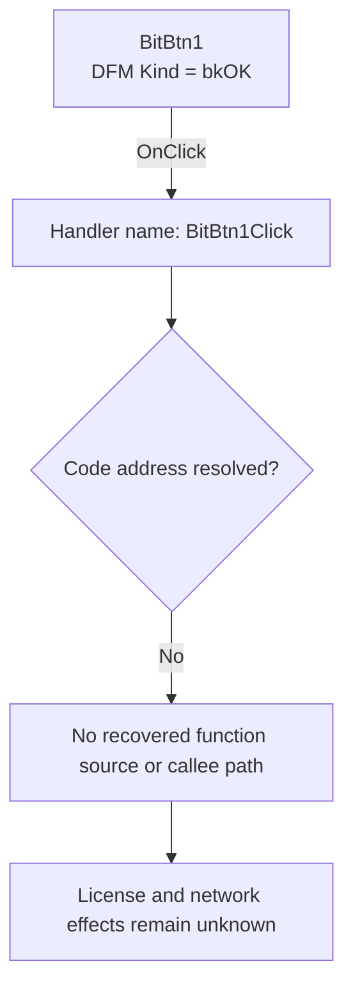

# BitBtn1

> Analysis status: Blocked by an unresolved event-handler address.

## Control

| Property | Recovered value |
| --- | --- |
| Form | SuspendAuthDlg |
| Component path | SuspendAuthDlg.BitBtn1 |
| Control class | TBitBtn |
| Caption | Not present in the recovered resource. |
| Hint | Not present in the recovered resource. |
| Text | Not present in the recovered resource. |
| Handler name | BitBtn1Click |
| Handler address | Not present in the recovered resource. |
| Graph node | `resource:dfm:SuspendAuthDlg/SuspendAuthDlg.BitBtn1` |
| Handler node | `concept:dfm-handler:TSuspendAuthDlg/BitBtn1Click` |
| Graph layer | tina.exe |

## What happens when clicked

The recovered DFM stream binds `SuspendAuthDlg.BitBtn1.OnClick` to the method name `BitBtn1Click`. The checked-in extractor could not resolve a code address from this event binding or from the `TSuspendAuthDlg` published-method table. The graph therefore contains an unresolved handler concept, not a recovered function.

The form caption is `Upload license to the Internet`. The form also contains the `OrderNumEB` editor and a warning that the program cannot be used after pressing OK until the license is downloaded again. The button has the built-in kind `bkOK`. These resources establish the dialog context and the button's OK presentation. They do not prove that the handler reads the order number, validates it, contacts a server, uploads or removes a license, closes the dialog, or reports an error.

No recovered source establishes the input checks, network endpoint, state change, success result, failure result, or no-op behavior of `BitBtn1Click`.

## Click flow

## Handler evidence

- Source: [DecompiledSources/Tina16/resources/dfm/ui-evidence.json](../../../DecompiledSources/Tina16/resources/dfm/ui-evidence.json)
- Extractor: [analysis/undelphi/TiaraUiEvidence.rs](../../../analysis/undelphi/TiaraUiEvidence.rs)
- Recovered role: Unknown because no handler function was resolved.
- Current graph summary: Unresolved Delphi event handler TSuspendAuthDlg.BitBtn1Click, referenced by 1 UI event.
- Current graph behavior: Unknown.
- Current graph evidence: The trigger edge preserves the DFM method name, but its handler address is null.
- Complexity: simple
- Distinct outgoing calls: None. The handler node is an unresolved concept.

## Direct calls

- No direct call edge is present. A call tree cannot start without a recovered handler address.

## Resource evidence

- Kind: bkOK
- Modal result: Not present in the recovered resource.
- Checked state: Not present in the recovered resource.
- List items: Not present in the recovered resource.
- Image reference: Not present in the recovered resource.
- Extracted glyph: None.

## Nearby label candidates

Nearby labels are layout candidates only. They are not proof of behavior.

- Rank 1: Note that, after pressing OK you will not be able to use the program until you download your license again! at distance 156.
- Rank 2: Order number: at distance 218.

## Analysis limits

- The DFM provides the `BitBtn1Click` name but no code address.
- RTTI and VMT resolution did not find a published method address for this event. The `FormCreate` and `FormHelp` events on the same `TSuspendAuthDlg` class also remain unresolved.
- The graph has no function node, source file, outgoing call, extracted glyph, network endpoint, or function annotation for this binding.
- A schema-complete function annotation cannot be created without an address and evidence-backed scalar fields.
- A later recovery must identify the handler address and inspect its source and relevant callees before it can describe application behavior.
