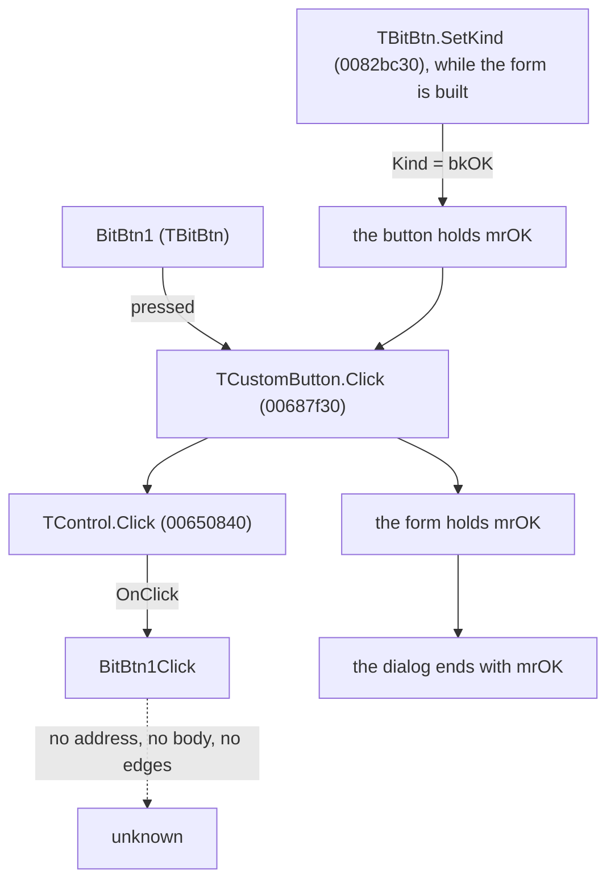

# BitBtn1

> Analysis status: Recovered as far as the image allows; the custom handler is inside a class the protector kept.

## Control

| Property | Recovered value |
| --- | --- |
| Form | SuspendAuthDlg |
| Component path | SuspendAuthDlg.BitBtn1 |
| Control class | TBitBtn |
| Caption | Not present in the recovered resource. |
| Hint | Not present in the recovered resource. |
| Kind | bkOK |
| Handler name | BitBtn1Click |
| Handler address | Not in the image - see below. |
| Graph node | `resource:dfm:SuspendAuthDlg/SuspendAuthDlg.BitBtn1` |
| Handler node | `concept:dfm-handler:TSuspendAuthDlg/BitBtn1Click` |
| Graph layer | UI |

## What happens when clicked

`BitBtn1` sits on SuspendAuthDlg - the dialog that uploads a licence to the internet so it can be taken up on another machine.

The resource gives this button `Kind = bkOK`, and what that means is recovered code rather than a guess. While the form is built, TBitBtn.SetKind (0082bc30) reads the kind and gives the button the modal result it stands for - here `mrOK` (1) - along with its default or cancel state. When the button is pressed, TCustomButton.Click (00687f30) copies that result into the form it sits on, and only afterwards does TControl.Click (00650840) dispatch `BitBtn1Click`. So the press sets the form's modal result and ends the dialog with it whatever the custom handler does.

What `BitBtn1Click` itself does - whether it validates, what it writes, whether it can refuse to close - is not in the image.

## Click flow

## Inputs

- The button's `Kind`, which the resource records as `bkOK`. That is an input to the VCL path above and is known.
- Whatever `BitBtn1Click` reads from the form. Not known: the handler is not in the image.

## Decisions

- The VCL takes no decision here beyond setting the modal result. Whether the dialog then actually closes rests with the form's `OnCloseQuery`, which this form binds and which is not in the image either - so a refusal to close is possible and cannot be ruled out.

## State changes

- The form's modal result becomes `mrOK`. That is recovered.
- Any other change is not known. Nothing in the image says what `BitBtn1Click` writes.

## Outputs

- The dialog ends with `mrOK`, which is what its caller reads.

## Errors and no-op behaviour

- Not known. Whether `BitBtn1Click` can fail, and what it does when there is nothing to do, is not in the image.

## Why the handler is not in the image

`TSuspendAuthDlg` is one of 26 form classes in this image whose event bindings resolve to nothing at all. Across the whole resource, 320 forms carry at least one binding: 293 resolve every one of theirs, 26 resolve none of theirs, and one resolves some. This form is in the second group - 3 bindings, 0 resolved.

The cause is known and is not a gap in the analysis. A Delphi event binding is followed by finding the class's published method table, which hangs off its VMT. For these 26 classes the image holds the class name only inside the DFM stream: there is no second instance of it to anchor a VMT, so no published method table can be found and no handler name can be turned into an address. The pages that would hold them are the ones the protector left encrypted. No further static work on this image will recover them.

## Evidence

- Resource: [DecompiledSources/Tina16/resources/dfm/ui-evidence.json](../../../DecompiledSources/Tina16/resources/dfm/ui-evidence.json)
- TBitBtn.SetKind, which maps the Kind the resource records onto the button's ModalResult and its default or cancel state: [DecompiledSources/Tina16/functions/000000000082BC30__FUN_0082bc30.c](../../../DecompiledSources/Tina16/functions/000000000082BC30__FUN_0082bc30.c)
- TCustomButton.Click, which writes that ModalResult into the parent form before the click is dispatched: [DecompiledSources/Tina16/functions/0000000000687F30__FUN_00687f30.c](../../../DecompiledSources/Tina16/functions/0000000000687F30__FUN_00687f30.c)
- TControl.Click, which dispatches the OnClick the resource names: [DecompiledSources/Tina16/functions/0000000000650840__FUN_00650840.c](../../../DecompiledSources/Tina16/functions/0000000000650840__FUN_00650840.c)
- The other controls on this form that do something: `SuspendAuthDlg` (Upload license to the Internet).
- No extracted glyph is associated with this control.

## Analysis limits

- The caption, the hint, the control class and the labels near it are not evidence of behaviour and none of them was used as such here.
- Recovering `BitBtn1Click` needs the class table, which needs the protected pages. Watching the running program would settle what the control does without settling how, and for this form not attempted: it belongs to licensing, and pressing its controls on a real installation could move or destroy a licence.
