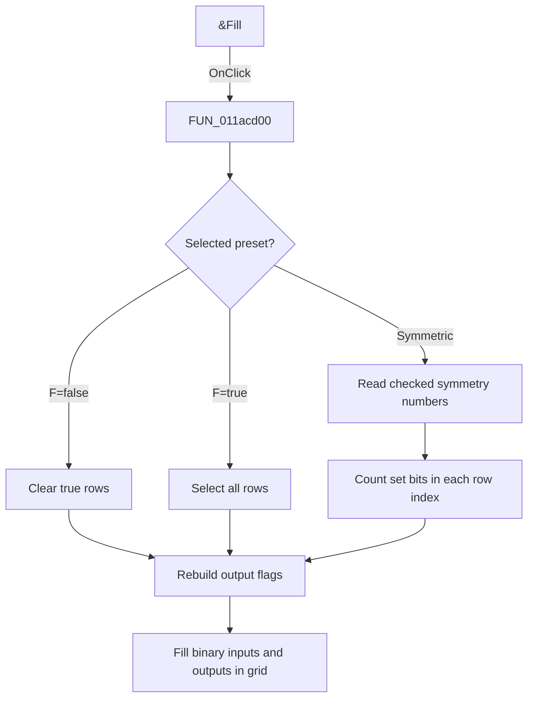

# &Fill

> Analysis status: Source and call-path review complete.

## Control

| Property | Recovered value |
| --- | --- |
| Form | tables_form |
| Component path | tables_form.SpecialBox.BitBtn1 |
| Control class | TBitBtn |
| Caption | &Fill |
| Hint | Not present in the recovered resource. |
| Text | Not present in the recovered resource. |
| Handler name | BitBtn1Click |
| Handler address | 011acd00 |
| Graph node | `resource:dfm:tables_form/tables_form.SpecialBox.BitBtn1` |
| Handler node | `function:011acd00` |
| Graph layer | UI |

## What happens when clicked

The handler applies the selected function preset to the truth table. The `F=false` preset clears the true-row list. The `F=true` preset selects every data row. When the Symmetry number group is visible, the handler reads check boxes `0` through `8` and selects rows whose low-eight-bit set-bit count matches a checked number. It then rebuilds the grid with binary input values and the selected output flags. It also sets help context `2100`.

## Click flow

## Handler evidence

- Source: [DecompiledSources/Tina16/functions/00000000011ACD00__FUN_011acd00.c](../../../DecompiledSources/Tina16/functions/00000000011ACD00__FUN_011acd00.c)
- Recovered role: Truth-table preset fill handler
- Current graph summary: Applies the false, true, or symmetric preset and repopulates the truth-table grid.
- Current graph behavior: Uses `CountSetBits8` to map each row index to a symmetry-number check box. It then rebuilds the binary input columns and output column from the selected row flags.
- Current graph evidence: The handler tests the `F=false` and `F=true` radio controls, reads the nine symmetry check boxes when their group is visible, calls annotated `CountSetBits8`, resets the 256 output flags, and calls the recovered grid-population function. The extracted two-frame check-mark glyph supports an apply action.
- Complexity: complex
- Distinct outgoing calls: 5

## Direct calls

- `function:00414ad0` — Delphi UnicodeString assignment helper
- `function:0119a4f0` — FUN_0119a4f0
- `function:011abdf0` — FUN_011abdf0
- `function:011acfa0` — Handles 1 Delphi UI event: tables_form.SpecialBox.RadioF0.OnClick.
- `function:011acff0` — Handles 1 Delphi UI event: tables_form.SpecialBox.RadioF1.OnClick.

## Resource evidence

- Kind: Not present in the recovered resource.
- Modal result: 8
- Checked state: Not present in the recovered resource.
- List items: Not present in the recovered resource.
- Image reference: Not present in the recovered resource.
- Extracted glyph: [`0486_tables_form_tables_form_SpecialBox_BitBtn1_Glyph_Data.png`](../../../glyph/0486_tables_form_tables_form_SpecialBox_BitBtn1_Glyph_Data.png)

## Nearby label candidates

Nearby labels are layout candidates only. They are not proof of behavior.

- No same-parent label candidate is available.

## Analysis limits

- The resource has modal result `8`, but the handler does not explicitly close the form.
- The recovered C does not give Delphi names for the shared true-row arrays.
