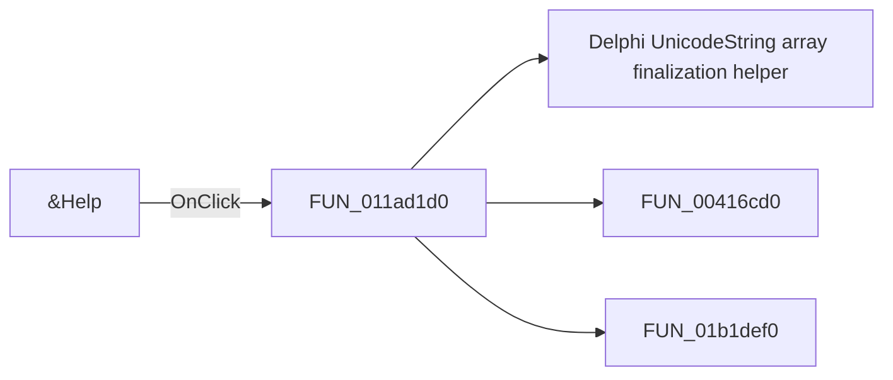

# &Help

> Analysis status: Pending individual source review.

## Control

| Property | Recovered value |
| --- | --- |
| Form | tables_form |
| Component path | tables_form.GroupBox1.BtnHelp |
| Control class | TBitBtn |
| Caption | &Help |
| Hint | Not present in the recovered resource. |
| Text | Not present in the recovered resource. |
| Handler name | BtnHelpClick |
| Handler address | 011ad1d0 |
| Graph node | `resource:dfm:tables_form/tables_form.GroupBox1.BtnHelp` |
| Handler node | `function:011ad1d0` |
| Graph layer | UI |

## What happens when clicked

Pending individual analysis. An agent must read the recovered handler source and its relevant callees before it replaces this text.

## Click flow

## Handler evidence

- Source: [DecompiledSources/Tina16/functions/00000000011AD1D0__FUN_011ad1d0.c](../../../DecompiledSources/Tina16/functions/00000000011AD1D0__FUN_011ad1d0.c)
- Recovered role: Not present in the recovered resource.
- Current graph summary: Handles 1 Delphi UI event: tables_form.GroupBox1.BtnHelp.OnClick.
- Current graph behavior: Not present in the recovered resource.
- Current graph evidence: Not present in the recovered resource.
- Complexity: complex
- Distinct outgoing calls: 3

## Direct calls

- `function:00414560` — Delphi UnicodeString array finalization helper
- `function:00416cd0` — FUN_00416cd0
- `function:01b1def0` — FUN_01b1def0

## Resource evidence

- Kind: Not present in the recovered resource.
- Modal result: Not present in the recovered resource.
- Checked state: Not present in the recovered resource.
- List items: Not present in the recovered resource.
- Image reference: Not present in the recovered resource.
- Extracted glyph: [`0485_tables_form_tables_form_GroupBox1_BtnHelp_Glyph_Data.png`](../../../glyph/0485_tables_form_tables_form_GroupBox1_BtnHelp_Glyph_Data.png)

## Nearby label candidates

Nearby labels are layout candidates only. They are not proof of behavior.

- No same-parent label candidate is available.

## Analysis limits

- Do not infer behavior from the control class, caption, hint, glyph, or nearby label alone.
- Do not replace the pending status until the handler source and relevant call path provide enough evidence.
