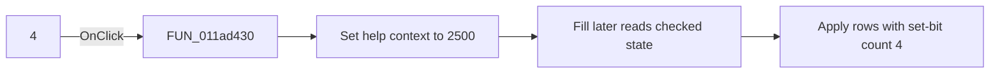

# 4

> Analysis status: Source and call-path review complete.

## Control

| Property | Recovered value |
| --- | --- |
| Form | tables_form |
| Component path | tables_form.SpecialBox.simmNumer.CheckBox5 |
| Control class | TCheckBox |
| Caption | 4 |
| Hint | Not present in the recovered resource. |
| Text | Not present in the recovered resource. |
| Handler name | CheckBox5Click |
| Handler address | 011ad430 |
| Graph node | `resource:dfm:tables_form/tables_form.SpecialBox.simmNumer.CheckBox5` |
| Handler node | `function:011ad430` |
| Graph layer | UI |

## What happens when clicked

This check box represents symmetry number `4`. The recovered application handler only sets help context `2500`. It does not rebuild the table. When Fill runs, it reads this checked state and selects rows whose low-eight-bit set-bit count is `4`.

## Click flow

## Handler evidence

- Source: [DecompiledSources/Tina16/functions/00000000011AD430__FUN_011ad430.c](../../../DecompiledSources/Tina16/functions/00000000011AD430__FUN_011ad430.c)
- Recovered role: Symmetry-number 4 help-context selector
- Current graph summary: Sets the symmetry help context after the number-4 check state changes.
- Current graph behavior: Stores help context `2500`. Fill later reads this control and uses it for rows whose set-bit count is `4`.
- Current graph evidence: The resource caption is `4`. The click handler contains only a store of `0x9c4`. The Fill handler reads CheckBox5 and compares it with the annotated low-eight-bit set-bit count for each row index.
- Complexity: simple
- Distinct outgoing calls: 0

## Direct calls

- No direct call edge is present in the recovered graph.

## Resource evidence

- Kind: Not present in the recovered resource.
- Modal result: Not present in the recovered resource.
- Checked state: Not present in the recovered resource.
- List items: Not present in the recovered resource.
- Image reference: Not present in the recovered resource.
- Extracted glyph: None.

## Nearby label candidates

Nearby labels are layout candidates only. They are not proof of behavior.

- No same-parent label candidate is available.

## Analysis limits

- The click handler does not itself read the checked state or write a grid cell.
