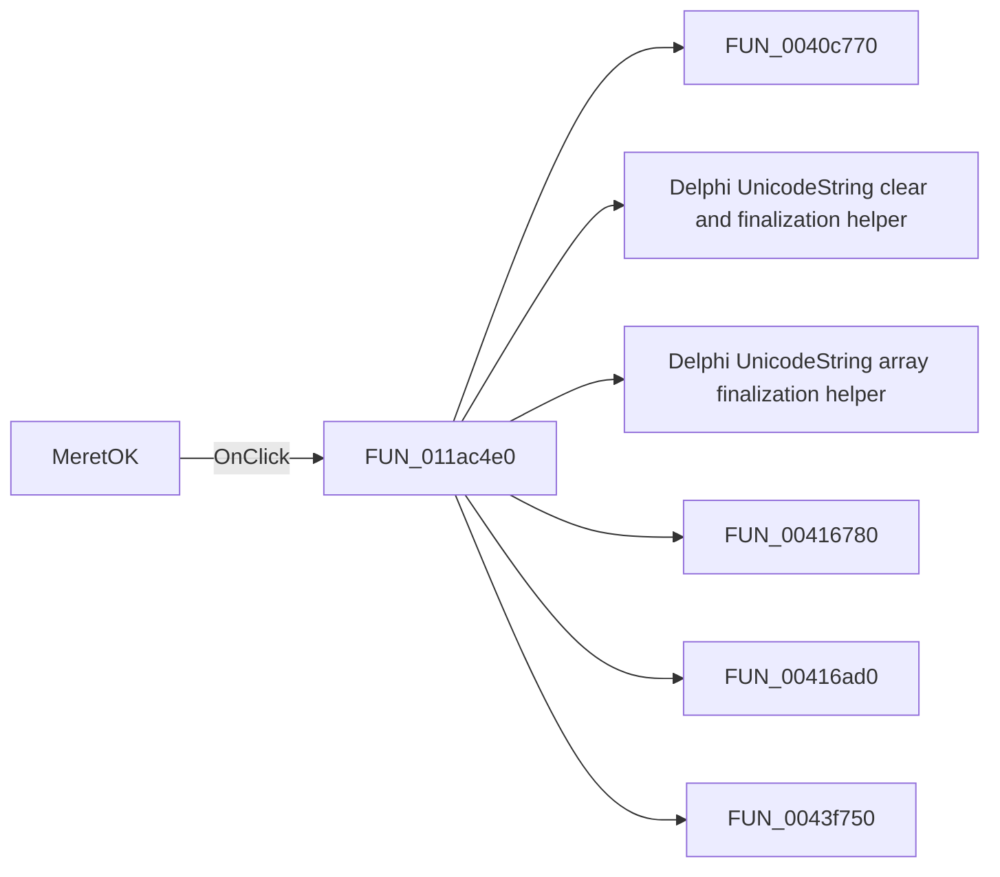

# MeretOK

> Analysis status: Pending individual source review.

## Control

| Property | Recovered value |
| --- | --- |
| Form | tables_form |
| Component path | tables_form.MeretOK |
| Control class | TButton |
| Caption | MeretOK |
| Hint | Not present in the recovered resource. |
| Text | Not present in the recovered resource. |
| Handler name | MeretOKClick |
| Handler address | 011ac4e0 |
| Graph node | `resource:dfm:tables_form/tables_form.MeretOK` |
| Handler node | `function:011ac4e0` |
| Graph layer | UI |

## What happens when clicked

Pending individual analysis. An agent must read the recovered handler source and its relevant callees before it replaces this text.

## Click flow

## Handler evidence

- Source: [DecompiledSources/Tina16/functions/00000000011AC4E0__FUN_011ac4e0.c](../../../DecompiledSources/Tina16/functions/00000000011AC4E0__FUN_011ac4e0.c)
- Recovered role: Not present in the recovered resource.
- Current graph summary: Handles 1 Delphi UI event: tables_form.MeretOK.OnClick.
- Current graph behavior: Not present in the recovered resource.
- Current graph evidence: Not present in the recovered resource.
- Complexity: complex
- Distinct outgoing calls: 11

## Direct calls

- `function:0040c770` — FUN_0040c770
- `function:00414480` — Delphi UnicodeString clear and finalization helper
- `function:00414560` — Delphi UnicodeString array finalization helper
- `function:00416780` — FUN_00416780
- `function:00416ad0` — FUN_00416ad0
- `function:0043f750` — FUN_0043f750
- `function:0043fc00` — FUN_0043fc00
- `function:00526500` — FUN_00526500
- `function:0064dd90` — VCL control Unicode text reader
- `function:0064de00` — VCL control text setter with change suppression
- `function:011abdd0` — FUN_011abdd0

## Resource evidence

- Kind: Not present in the recovered resource.
- Modal result: Not present in the recovered resource.
- Checked state: Not present in the recovered resource.
- List items: Not present in the recovered resource.
- Image reference: Not present in the recovered resource.
- Extracted glyph: None.

## Nearby label candidates

Nearby labels are layout candidates only. They are not proof of behavior.

- Rank 1: Meret: at distance 135.

## Analysis limits

- Do not infer behavior from the control class, caption, hint, glyph, or nearby label alone.
- Do not replace the pending status until the handler source and relevant call path provide enough evidence.
