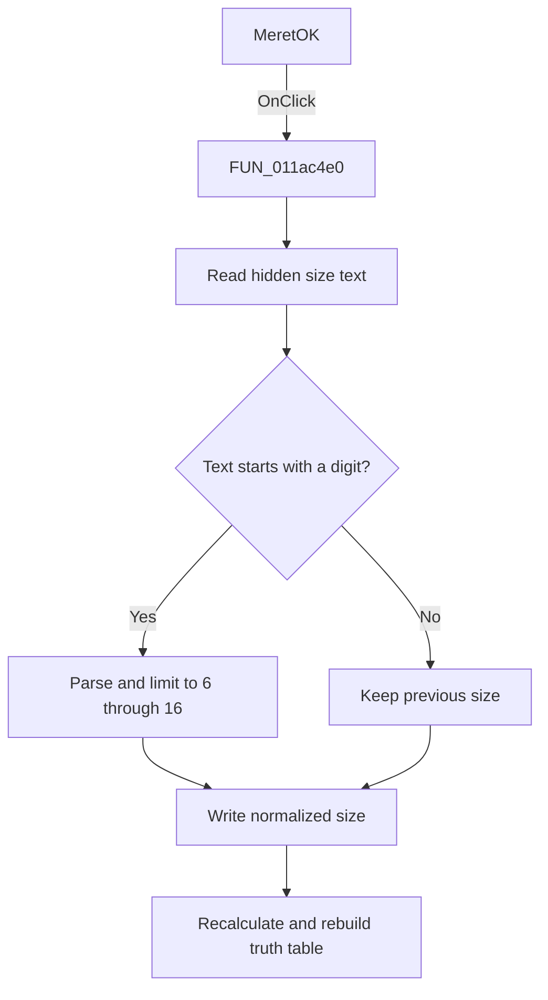

# MeretOK

> Analysis status: Source and call-path review complete.

## Control

| Property | Recovered value |
| --- | --- |
| Form | tables_form |
| Component path | tables_form.MeretOK |
| Control class | TButton |
| Caption | MeretOK |
| Hint | Not present in the recovered resource. |
| Text | Not present in the recovered resource. |
| Handler name | MeretOKClick |
| Handler address | 011ac4e0 |
| Graph node | `resource:dfm:tables_form/tables_form.MeretOK` |
| Handler node | `function:011ac4e0` |
| Graph layer | UI |

## What happens when clicked

This hidden button applies the hidden size edit. If the text starts with a digit, the handler parses it and limits the value to the range `6` through `16`. If the text is empty or starts with another character, it keeps the previous value. It writes the normalized value back, recalculates the truth-table dimensions and the `2^n` row count, and rebuilds the grid.

## Click flow

## Handler evidence

- Source: [DecompiledSources/Tina16/functions/00000000011AC4E0__FUN_011ac4e0.c](../../../DecompiledSources/Tina16/functions/00000000011AC4E0__FUN_011ac4e0.c)
- Recovered role: Hidden truth-table size apply handler
- Current graph summary: Normalizes a hidden size value to `6` through `16`, recalculates table geometry and row count, and rebuilds the truth table.
- Current graph behavior: Parses the edit only when its first character is a digit. Otherwise, it retains the prior size value and writes that value back to the edit.
- Current graph evidence: The resource marks `MeretOK`, the nearby `Meret:` label, and the associated edit as hidden. The handler reads the edit at form offset `0x6b0`, clamps the parsed global value, calculates `2^n`, and calls the table rebuild path.
- Complexity: complex
- Distinct outgoing calls: 11

## Direct calls

- `function:0040c770` — FUN_0040c770
- `function:00414480` — Delphi UnicodeString clear and finalization helper
- `function:00414560` — Delphi UnicodeString array finalization helper
- `function:00416780` — FUN_00416780
- `function:00416ad0` — FUN_00416ad0
- `function:0043f750` — FUN_0043f750
- `function:0043fc00` — FUN_0043fc00
- `function:00526500` — FUN_00526500
- `function:0064dd90` — VCL control Unicode text reader
- `function:0064de00` — VCL control text setter with change suppression
- `function:011abdd0` — FUN_011abdd0

## Resource evidence

- Kind: Not present in the recovered resource.
- Modal result: Not present in the recovered resource.
- Checked state: Not present in the recovered resource.
- List items: Not present in the recovered resource.
- Image reference: Not present in the recovered resource.
- Extracted glyph: None.

## Nearby label candidates

Nearby labels are layout candidates only. They are not proof of behavior.

- Rank 1: Meret: at distance 135.

## Analysis limits

- The recovered code does not identify the unit or user-facing name of the size value.
- The nearby `Meret:` label is Hungarian resource evidence, but proximity alone does not define the setting.
