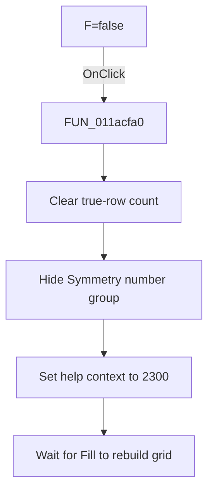

# F=false

> Analysis status: Source and call-path review complete.

## Control

| Property | Recovered value |
| --- | --- |
| Form | tables_form |
| Component path | tables_form.SpecialBox.RadioF0 |
| Control class | TRadioButton |
| Caption | F=false |
| Hint | Not present in the recovered resource. |
| Text | Not present in the recovered resource. |
| Handler name | RadioF0Click |
| Handler address | 011acfa0 |
| Graph node | `resource:dfm:tables_form/tables_form.SpecialBox.RadioF0` |
| Handler node | `function:011acfa0` |
| Graph layer | UI |

## What happens when clicked

The handler prepares the constant-false preset. It clears the current true-row count, hides the Symmetry number group, clears the loaded-table flag, and sets help context `2300`. It does not repopulate the grid. The Fill action applies the empty true-row list later.

## Click flow

## Handler evidence

- Source: [DecompiledSources/Tina16/functions/00000000011ACFA0__FUN_011acfa0.c](../../../DecompiledSources/Tina16/functions/00000000011ACFA0__FUN_011acfa0.c)
- Recovered role: Constant-false truth-table preset selector
- Current graph summary: Clears the true-row selection, hides symmetry controls, and prepares the constant-false preset for Fill.
- Current graph behavior: Resets the loaded-table flag and true-row count, sets the symmetry group visibility to false, and sets help context `2300`.
- Current graph evidence: The resource caption is `F=false` and it is initially checked. The handler stores zero to the model flags and calls the annotated VCL visibility setter with the Symmetry number group and false.
- Complexity: simple
- Distinct outgoing calls: 1

## Direct calls

- `function:0064dbe0` — FUN_0064dbe0

## Resource evidence

- Kind: Not present in the recovered resource.
- Modal result: Not present in the recovered resource.
- Checked state: true
- List items: Not present in the recovered resource.
- Image reference: Not present in the recovered resource.
- Extracted glyph: None.

## Nearby label candidates

Nearby labels are layout candidates only. They are not proof of behavior.

- No same-parent label candidate is available.

## Analysis limits

- This handler does not write grid cells. The separate Fill handler consumes the prepared state.
