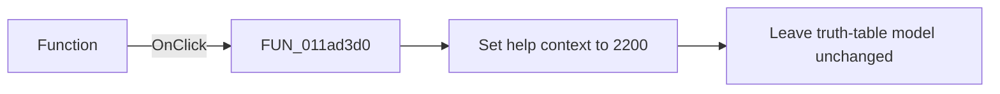

# Function

> Analysis status: Source and call-path review complete.

## Control

| Property | Recovered value |
| --- | --- |
| Form | tables_form |
| Component path | tables_form.SpecialBox.RadioGroup1 |
| Control class | TRadioGroup |
| Caption | Function |
| Hint | Not present in the recovered resource. |
| Text | Not present in the recovered resource. |
| Handler name | RadioGroup1Click |
| Handler address | 011ad3d0 |
| Graph node | `resource:dfm:tables_form/tables_form.SpecialBox.RadioGroup1` |
| Handler node | `function:011ad3d0` |
| Graph layer | UI |

## What happens when clicked

The recovered application handler only sets help context `2200`. It does not read the selected radio-group item, change the true-row list, or rebuild the grid. The function preset handlers and the Fill action perform those changes.

## Click flow

## Handler evidence

- Source: [DecompiledSources/Tina16/functions/00000000011AD3D0__FUN_011ad3d0.c](../../../DecompiledSources/Tina16/functions/00000000011AD3D0__FUN_011ad3d0.c)
- Recovered role: Function-group help-context selector
- Current graph summary: Sets help context `2200` when the Function group receives a click.
- Current graph behavior: Performs one shared help-context store and does not read or write truth-table state.
- Current graph evidence: The DFM binds `RadioGroup1.OnClick` to `FUN_011ad3d0`. The recovered body contains only a store of `0x898`, which is decimal `2200`, and a return.
- Complexity: simple
- Distinct outgoing calls: 0

## Direct calls

- No direct call edge is present in the recovered graph.

## Resource evidence

- Kind: Not present in the recovered resource.
- Modal result: Not present in the recovered resource.
- Checked state: Not present in the recovered resource.
- List items: Not present in the recovered resource.
- Image reference: Not present in the recovered resource.
- Extracted glyph: None.

## Nearby label candidates

Nearby labels are layout candidates only. They are not proof of behavior.

- No same-parent label candidate is available.

## Analysis limits

- The recovered resource does not expose the radio-group item strings.
- The handler does not show which item generated the click.
