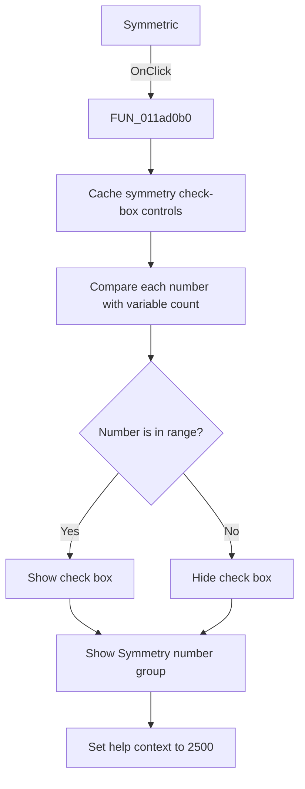

# Symmetric

> Analysis status: Source and call-path review complete.

## Control

| Property | Recovered value |
| --- | --- |
| Form | tables_form |
| Component path | tables_form.SpecialBox.RadioSymm |
| Control class | TRadioButton |
| Caption | Symmetric |
| Hint | Not present in the recovered resource. |
| Text | Not present in the recovered resource. |
| Handler name | RadioSymmClick |
| Handler address | 011ad0b0 |
| Graph node | `resource:dfm:tables_form/tables_form.SpecialBox.RadioSymm` |
| Handler node | `function:011ad0b0` |
| Graph layer | UI |

## What happens when clicked

The handler prepares the symmetric-function preset. It caches the nine symmetry-number check boxes, shows the Symmetry number group, and shows only check boxes `0` through the current input-variable count. It hides higher-number check boxes. It clears the loaded-table flag and sets help context `2500`. It does not select a symmetry number or rebuild the grid.

## Click flow

## Handler evidence

- Source: [DecompiledSources/Tina16/functions/00000000011AD0B0__FUN_011ad0b0.c](../../../DecompiledSources/Tina16/functions/00000000011AD0B0__FUN_011ad0b0.c)
- Recovered role: Symmetric truth-table preset selector
- Current graph summary: Shows the applicable symmetry-number choices and prepares symmetric mode for Fill.
- Current graph behavior: Makes check boxes `0` through the input-variable count visible, hides higher values, shows the group, clears the loaded-table flag, and sets help context `2500`.
- Current graph evidence: The handler reads the nine child controls, compares their zero-based positions with the model value at offset `0x764`, and calls the annotated VCL visibility setter for each control and the parent group.
- Complexity: simple
- Distinct outgoing calls: 1

## Direct calls

- `function:0064dbe0` — FUN_0064dbe0

## Resource evidence

- Kind: Not present in the recovered resource.
- Modal result: Not present in the recovered resource.
- Checked state: Not present in the recovered resource.
- List items: Not present in the recovered resource.
- Image reference: Not present in the recovered resource.
- Extracted glyph: None.

## Nearby label candidates

Nearby labels are layout candidates only. They are not proof of behavior.

- No same-parent label candidate is available.

## Analysis limits

- This handler does not change any symmetry-number check state.
- The separate Fill handler reads the checked values and applies them to truth rows.
