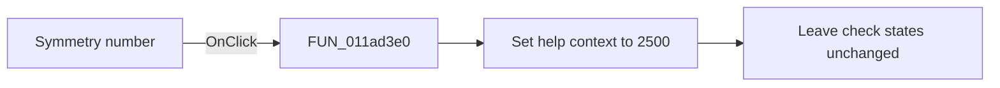

# Symmetry number

> Analysis status: Source and call-path review complete.

## Control

| Property | Recovered value |
| --- | --- |
| Form | tables_form |
| Component path | tables_form.SpecialBox.simmNumer |
| Control class | TGroupBox |
| Caption | Symmetry number |
| Hint | Not present in the recovered resource. |
| Text | Not present in the recovered resource. |
| Handler name | simmNumerClick |
| Handler address | 011ad3e0 |
| Graph node | `resource:dfm:tables_form/tables_form.SpecialBox.simmNumer` |
| Handler node | `function:011ad3e0` |
| Graph layer | UI |

## What happens when clicked

The recovered application handler only sets help context `2500`. Clicking the group surface does not change a symmetry-number check box and does not rebuild the truth table. The Fill action reads the child check boxes later.

## Click flow

## Handler evidence

- Source: [DecompiledSources/Tina16/functions/00000000011AD3E0__FUN_011ad3e0.c](../../../DecompiledSources/Tina16/functions/00000000011AD3E0__FUN_011ad3e0.c)
- Recovered role: Symmetry-number group help-context selector
- Current graph summary: Sets help context `2500` when the Symmetry number group surface receives a click.
- Current graph behavior: Performs one shared help-context store and does not change the group or truth-table state.
- Current graph evidence: The resource marks the group hidden by default. The recovered handler contains only a store of `0x9c4`, which is decimal `2500`, and a return.
- Complexity: simple
- Distinct outgoing calls: 0

## Direct calls

- No direct call edge is present in the recovered graph.

## Resource evidence

- Kind: Not present in the recovered resource.
- Modal result: Not present in the recovered resource.
- Checked state: Not present in the recovered resource.
- List items: Not present in the recovered resource.
- Image reference: Not present in the recovered resource.
- Extracted glyph: None.

## Nearby label candidates

Nearby labels are layout candidates only. They are not proof of behavior.

- No same-parent label candidate is available.

## Analysis limits

- The click handler does not identify a child check box. Each child has its own event.
