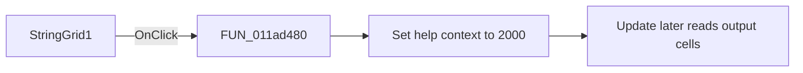

# StringGrid1

> Analysis status: Source and call-path review complete.

## Control

| Property | Recovered value |
| --- | --- |
| Form | tables_form |
| Component path | tables_form.StringGrid1 |
| Control class | TStringGrid |
| Caption | Not present in the recovered resource. |
| Hint | Not present in the recovered resource. |
| Text | Not present in the recovered resource. |
| Handler name | StringGrid1Click |
| Handler address | 011ad480 |
| Graph node | `resource:dfm:tables_form/tables_form.StringGrid1` |
| Handler node | `function:011ad480` |
| Graph layer | UI |

## What happens when clicked

The recovered application handler only sets help context `2000`. It does not read the selected cell or change grid data. The Update action later reads the output column and commits the edited truth-table values.

## Click flow

## Handler evidence

- Source: [DecompiledSources/Tina16/functions/00000000011AD480__FUN_011ad480.c](../../../DecompiledSources/Tina16/functions/00000000011AD480__FUN_011ad480.c)
- Recovered role: Truth-table grid help-context selector
- Current graph summary: Sets the general truth-table help context when the grid receives a click.
- Current graph behavior: Stores help context `2000` and does not read or write a grid cell.
- Current graph evidence: The DFM binds `StringGrid1.OnClick` to `FUN_011ad480`. Its recovered body contains only the help-context store. The recovered Update handler separately reads the grid output column.
- Complexity: simple
- Distinct outgoing calls: 0

## Direct calls

- No direct call edge is present in the recovered graph.

## Resource evidence

- Kind: Not present in the recovered resource.
- Modal result: Not present in the recovered resource.
- Checked state: Not present in the recovered resource.
- List items: Not present in the recovered resource.
- Image reference: Not present in the recovered resource.
- Extracted glyph: None.

## Nearby label candidates

Nearby labels are layout candidates only. They are not proof of behavior.

- Rank 1: Meret: at distance 622.

## Analysis limits

- Cell selection and editing are VCL grid behavior and are not implemented in this handler.
