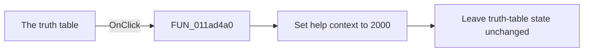

# The truth table

> Analysis status: Source and call-path review complete.

## Control

| Property | Recovered value |
| --- | --- |
| Form | tables_form |
| Component path | tables_form |
| Control class | Ttables_form |
| Caption | The truth table |
| Hint | Not present in the recovered resource. |
| Text | Not present in the recovered resource. |
| Handler name | FormClick |
| Handler address | 011ad4a0 |
| Graph node | `resource:dfm:tables_form` |
| Handler node | `function:011ad4a0` |
| Graph layer | UI |

## What happens when clicked

The handler sets the shared help-context value to `2000`. This prepares the general truth-table help topic. It does not open help, change the grid, or change the Boolean function.

## Click flow

## Handler evidence

- Source: [DecompiledSources/Tina16/functions/00000000011AD4A0__FUN_011ad4a0.c](../../../DecompiledSources/Tina16/functions/00000000011AD4A0__FUN_011ad4a0.c)
- Recovered role: Truth-table form help-context selection handler
- Current graph summary: Restores help-context ID 2000 when the Truth Table form surface is clicked. It prepares the form help topic without opening help or changing the truth table. Handles 1 Delphi UI event: tables_form.OnClick.
- Current graph behavior: Restores help-context ID 2000 when the Truth Table form surface is clicked. It prepares the form help topic without opening help or changing the truth table.
- Current graph evidence: tables_form.OnClick binds FormClick to this single-store function. Form creation and activation also store 2000, and the OnHelp handler passes the shared value with logiconv.chm to the help service.
- Complexity: simple
- Distinct outgoing calls: 0

## Direct calls

- No direct call edge is present in the recovered graph.

## Resource evidence

- Kind: Not present in the recovered resource.
- Modal result: Not present in the recovered resource.
- Checked state: Not present in the recovered resource.
- List items: Not present in the recovered resource.
- Image reference: Not present in the recovered resource.
- Extracted glyph: None.

## Nearby label candidates

Nearby labels are layout candidates only. They are not proof of behavior.

- No same-parent label candidate is available.

## Analysis limits

- The recovered code does not give a human-readable title for help-context value `2000`.
- The handler does not dispatch the help request. The separate Help handler uses the shared value.
