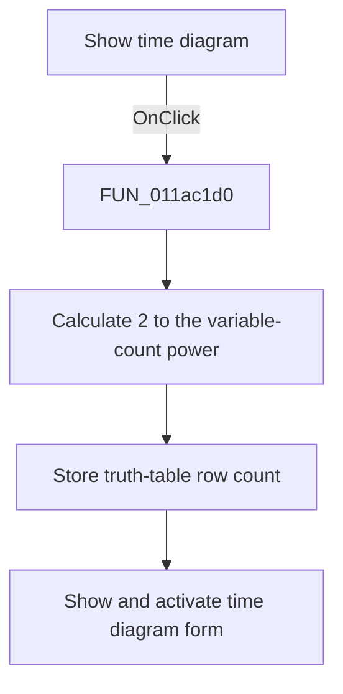

# Show time diagram

> Analysis status: Source and call-path review complete.

## Control

| Property | Recovered value |
| --- | --- |
| Form | tables_form |
| Component path | tables_form.Time_f |
| Control class | TButton |
| Caption | Show time diagram |
| Hint | Not present in the recovered resource. |
| Text | Not present in the recovered resource. |
| Handler name | Time_fClick |
| Handler address | 011ac1d0 |
| Graph node | `resource:dfm:tables_form/tables_form.Time_f` |
| Handler node | `function:011ac1d0` |
| Graph layer | UI |

## What happens when clicked

The handler calculates `2^n`, where `n` is the current input-variable count, and stores the result as the truth-table row count. It then shows and activates the shared form that the control caption identifies as the time diagram. The click does not validate or commit grid edits.

## Click flow

## Handler evidence

- Source: [DecompiledSources/Tina16/functions/00000000011AC1D0__FUN_011ac1d0.c](../../../DecompiledSources/Tina16/functions/00000000011AC1D0__FUN_011ac1d0.c)
- Recovered role: Truth-table time-diagram launcher
- Current graph summary: Recalculates the truth-table row count and shows the time-diagram form.
- Current graph behavior: Computes `2^n` from the shared input-variable count, stores it, and calls the annotated VCL form show-and-activate helper on a shared form instance.
- Current graph evidence: The handler passes floating-point `2.0` and the model value at offset `0x764` to the recovered power path, stores the integer result, and passes the global form pointer to `TCustomForm.Show`. The control caption is `Show time diagram`, and the resource set includes `time_w_form` with caption `Time diagram`.
- Complexity: complex
- Distinct outgoing calls: 3

## Direct calls

- `function:0040c770` — FUN_0040c770
- `function:00526500` — FUN_00526500
- `function:008059a0` — FUN_008059a0

## Resource evidence

- Kind: Not present in the recovered resource.
- Modal result: Not present in the recovered resource.
- Checked state: Not present in the recovered resource.
- List items: Not present in the recovered resource.
- Image reference: Not present in the recovered resource.
- Extracted glyph: None.

## Nearby label candidates

Nearby labels are layout candidates only. They are not proof of behavior.

- Rank 1: Meret: at distance 95.

## Analysis limits

- The recovered global pointer does not preserve a Delphi field name.
- The handler does not refresh or validate individual grid cells before it shows the form.
