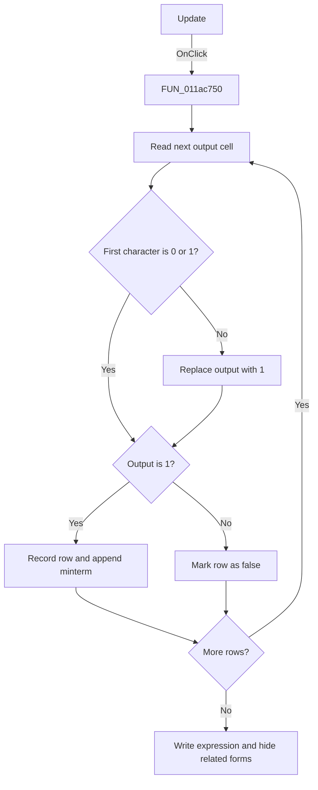

# Update

> Analysis status: Source and call-path review complete.

## Control

| Property | Recovered value |
| --- | --- |
| Form | tables_form |
| Component path | tables_form.GroupBox1.UpdateBtn |
| Control class | TButton |
| Caption | Update |
| Hint | Not present in the recovered resource. |
| Text | Not present in the recovered resource. |
| Handler name | UpdateBtnClick |
| Handler address | 011ac750 |
| Graph node | `resource:dfm:tables_form/tables_form.GroupBox1.UpdateBtn` |
| Handler node | `function:011ac750` |
| Graph layer | UI |

## What happens when clicked

The handler reads each output cell in the truth table. It accepts `0` and `1`. It replaces any other first character with `1` in the grid. For each `1` row, it records the row, marks the output state, and builds a Boolean minterm from the input cells and variable names. If no row is `1`, it builds a fallback expression that pairs each variable with its complement. It writes the final expression to the shared function editors, hides three related forms, and sets help context `2600`.

## Click flow

## Handler evidence

- Source: [DecompiledSources/Tina16/functions/00000000011AC750__FUN_011ac750.c](../../../DecompiledSources/Tina16/functions/00000000011AC750__FUN_011ac750.c)
- Recovered role: Truth-table output commit and Boolean-expression builder
- Current graph summary: Normalizes truth-table outputs, records the true rows, builds the Boolean expression, updates shared editors, and hides related result forms.
- Current graph behavior: Treats an output whose first character is not `0` or `1` as `1`. It derives minterms from the input cells for true rows and updates the shared Boolean-function state.
- Current graph evidence: The handler reads and writes `StringGrid1` cells through `FUN_0084e320` and `FUN_0084e3e0`, tests UTF-16 characters `0x30` and `0x31`, updates the true-row flag and index arrays, writes two editor controls, and calls the annotated form-hide helper three times.
- Complexity: complex
- Distinct outgoing calls: 15

## Direct calls

- `function:00414480` — Delphi UnicodeString clear and finalization helper
- `function:00414560` — Delphi UnicodeString array finalization helper
- `function:00414b50` — FUN_00414b50
- `function:00414de0` — FUN_00414de0
- `function:00416ad0` — FUN_00416ad0
- `function:00416cd0` — FUN_00416cd0
- `function:00416dc0` — FUN_00416dc0
- `function:00417600` — FUN_00417600
- `function:00417840` — FUN_00417840
- `function:0043ea00` — FUN_0043ea00
- `function:0064dd90` — VCL control Unicode text reader
- `function:0064de00` — VCL control text setter with change suppression
- `function:00805990` — FUN_00805990
- `function:0084e320` — FUN_0084e320
- `function:0084e3e0` — FUN_0084e3e0

## Resource evidence

- Kind: Not present in the recovered resource.
- Modal result: Not present in the recovered resource.
- Checked state: Not present in the recovered resource.
- List items: Not present in the recovered resource.
- Image reference: Not present in the recovered resource.
- Extracted glyph: None.

## Nearby label candidates

Nearby labels are layout candidates only. They are not proof of behavior.

- No same-parent label candidate is available.

## Analysis limits

- Recovered string constants do not expose the Boolean operator glyphs in the C output.
- The handler does not show an error message for an invalid output cell. It changes that cell to `1`.
