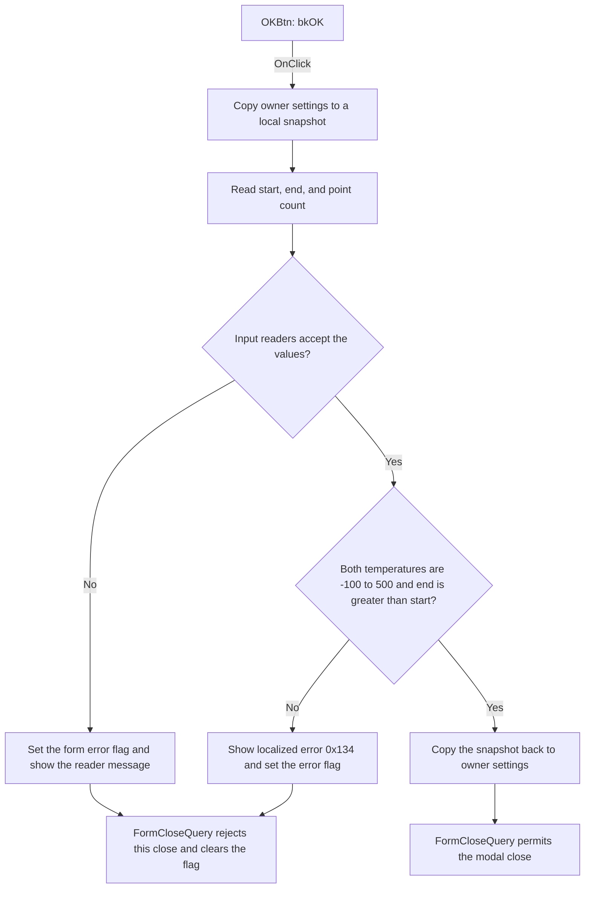

# OKBtn

> Analysis status: Source reviewed. The temperature validation and commit path is documented.

## Control

| Property | Recovered value |
| --- | --- |
| Form | TempAnalDlg |
| Component path | TempAnalDlg.OKBtn |
| Control class | TBitBtn |
| Caption | Not present in the recovered resource. |
| Hint | Not present in the recovered resource. |
| Text | Not present in the recovered resource. |
| Handler name | OKBtnClick |
| Handler address | 012b3d20 |
| Graph node | `resource:dfm:TempAnalDlg/TempAnalDlg.OKBtn` |
| Handler node | `function:012b3d20` |
| Graph layer | UI |

## What happens when clicked

`OKBtn` validates the temperature-analysis inputs and commits them to the owning
analysis object. The handler first copies the owner's 682-byte settings record
to a local snapshot. It then replaces three fields in that snapshot:

- `EditStartVal` supplies the start temperature in degrees Celsius.
- `EditEndVal` supplies the end temperature in degrees Celsius.
- `EditPoints` supplies the number of points.

The float-edit readers parse both temperatures. The integer-edit reader parses
the point count and checks the edit control's runtime minimum and maximum. The
handler then applies these temperature rules:

- Start and end must each be from `-100` through `500`, inclusive.
- End must be greater than start.

If the rules pass and the form error flag at `+0x710` is clear,
`FUN_00417c40` copies the complete local snapshot back to the owner record. The
output fields are at owner offsets `+0x870` for points, `+0x872` for start, and
`+0x87A` for end. [`FormCreate`](../../../DecompiledSources/Tina16/functions/00000000012B3EF0__FUN_012b3ef0.c)
reads the same offsets to initialize the three controls. This confirms the
field mapping.

If a temperature rule fails, the handler loads localized string resource
`0x134` and calls [`FUN_012b3cc0`](../../../DecompiledSources/Tina16/functions/00000000012B3CC0__FUN_012b3cc0.c).
That path displays the first validation message and sets the error flag. The
handler then skips the record copy. [`FormCloseQuery`](../../../DecompiledSources/Tina16/functions/00000000012B3ED0__FUN_012b3ed0.c)
sees the flag, rejects this close attempt, and clears the flag for the next
attempt. The exact text of resource `0x134` is not recovered.

The input readers can also report invalid text or a value outside an editor's
runtime limits. The bound edit-error handlers use the same error flag, so such
an error also prevents the commit and close. A valid click commits the snapshot,
and the built-in `bkOK` behavior can close the dialog.

## Click flow

## Handler evidence

- Source: [DecompiledSources/Tina16/functions/00000000012B3D20__FUN_012b3d20.c](../../../DecompiledSources/Tina16/functions/00000000012B3D20__FUN_012b3d20.c)
- Recovered role: Temperature-analysis settings validation and commit handler.
- Current graph summary: Handles 1 Delphi UI event: TempAnalDlg.OKBtn.OnClick.
- Behavior: Reads start temperature, end temperature, and point count into a local settings snapshot. It commits the snapshot only when both temperatures are from -100 through 500, end is greater than start, and no input-reader error is active.
- Evidence: The handler writes the three control values into local record offsets that match owner offsets `+0x870`, `+0x872`, and `+0x87A` read by `FormCreate`. Its condition rejects either temperature outside the recovered limits and rejects `end <= start`. The error helper sets byte `+0x710`, which `FormCloseQuery` uses to reject the close.
- Complexity: complex
- Distinct outgoing calls: 9

## Direct calls

- `function:00417580` — initializes the local managed-record snapshot.
- `function:00417c40` — copies the managed settings record in both directions.
- `function:00b90090` — reads and validates each float-edit value.
- `function:00f04d50` — reads the integer point count and checks its configured range.
- `function:00b89270` — gets the application string-resource manager.
- `function:00b8e520` — loads localized validation string `0x134`.
- `function:012b3cc0` — displays the first validation message and sets the form error flag.
- `function:00414480` — clears the temporary Delphi UnicodeString.
- `function:00417740` — finalizes the local managed-record snapshot.

## Resource evidence

- Kind: bkOK
- Modal result: Not present in the recovered resource.
- Checked state: Not present in the recovered resource.
- Inputs: `EditStartVal`, `EditEndVal`, and `EditPoints`.
- Labels: `Start temperature`, `End temperature`, and `Number of points`.
- Temperature units: Both temperature editors have an adjacent `[C]` label.
- List items: Not present in the recovered resource.
- Image reference: Not present in the recovered resource.
- Extracted glyph: None.

## Nearby label candidates

Nearby labels are layout candidates only. They are not proof of behavior.

- Rank 1: [C] at distance 43.
- Rank 2: [C] at distance 69.
- Rank 3: &Start temperature at distance 264.
- Rank 4: &End temperature at distance 289.
- Rank 5: &Number of points at distance 315.

## Analysis limits

- The exact text of localized string resource `0x134` is not present in the recovered files.
- The DFM does not expose the point edit's runtime minimum and maximum. This analysis does not assign numeric point-count limits.
- The built-in `bkOK` behavior supplies the modal close request. The handler validates and commits data; `FormCloseQuery` makes the final close decision.
