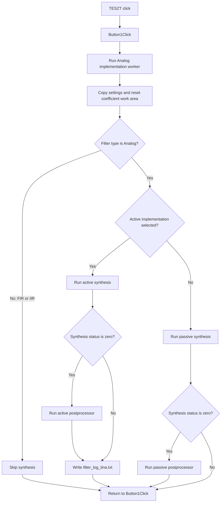

# TESZT

## Control

| Property | Recovered value |
| --- | --- |
| Form | TesztForm1 |
| Component path | TesztForm1.Button1 |
| Control class | TButton |
| Caption | TESZT |
| Hint | Not present in the recovered resource. |
| Text | Not present in the recovered resource. |
| Handler name | Button1Click |
| Handler address | 0115dcc0 |
| Graph node | `resource:dfm:TesztForm1/TesztForm1.Button1` |
| Handler node | `function:0115dcc0` |
| Graph layer | UI |

## What happens when clicked

The click runs the Analog filter implementation stage. The handler does not
read `TesztEdit1`, `symmetricalEdit1`, or `TestListBox1`. It passes the shared
Analog filter form to `FUN_012281f0`, which is the same implementation worker
that the **Build** and **Check** controls on `Analog_form1` use.

The worker copies three implementation values and two response-frequency
values to shared design state. It resets the shared coefficient work area. For
the Analog filter-type code, it reads the Active/Passive selection and runs the
matching synthesis path. It stores the synthesis return code in the shared
build status. It runs the matching postprocessor only when that return code is
zero. After the active synthesis path, it writes `filter_log_tina.txt` whether
the synthesis status is zero or nonzero. For the FIR and IIR filter-type codes,
it copies and resets the shared state but does not run an active or passive
synthesis path.

This test handler bypasses the input-validation and response-calculation stages
that the normal **Build** and **Check** handlers run before the implementation
worker. It also does not test the shared status before or after the call. It
does not dispatch a diagram, macro, or SPICE-file output, close either form, or
write a result to the Teszt form list. The handler has no local error message,
retry, or rollback path.

## Click flow

## Handler evidence

- Handler source: [FUN_0115dcc0](../../../DecompiledSources/Tina16/functions/000000000115DCC0__FUN_0115dcc0.c)
- Implementation worker: [FUN_012281f0](../../../DecompiledSources/Tina16/functions/00000000012281F0__FUN_012281f0.c)
- Normal Build handler: [FUN_0122e740](../../../DecompiledSources/Tina16/functions/000000000122E740__FUN_0122e740.c)
- Normal Check handler: [FUN_01234120](../../../DecompiledSources/Tina16/functions/0000000001234120__FUN_01234120.c)
- Recovered role: Run the Analog filter implementation stage from the Teszt form.
- Complexity: simple
- Distinct outgoing calls: 1

The DFM binds `TesztForm1.Button1.OnClick` to `Button1Click` at `0115dcc0`.
The handler contains one call and passes the global Analog form object to
`FUN_012281f0`. The worker's recovered field accesses and its annotated graph
evidence identify its settings, filter-type decision, active and passive
branches, shared status write, and zero-status postprocessor gates. The normal
Build and Check handlers call the same worker only after their earlier stages
leave the shared status at zero.

## Direct calls

- `function:012281f0` - construct the selected active or passive Analog filter
  implementation.

## Resource evidence

- Kind: Not present in the recovered resource.
- Modal result: Not present in the recovered resource.
- Checked state: Not present in the recovered resource.
- List items: Not present in the recovered resource.
- Image reference: Not present in the recovered resource.
- Extracted glyph: None.
- The form also contains `TestListBox1`, `TesztEdit1` with initial text `a`,
  and `symmetricalEdit1` with initial text `S`. The handler and its worker do
  not read these controls.

## Nearby label candidates

Nearby labels are layout candidates only. They are not proof of behavior.

- No same-parent label candidate is available.

## Analysis limits

- The recovered symbols do not identify why this internal Teszt form exposes
  the normal Analog implementation worker.
- The worker writes a shared status, but this handler does not read it. This
  source does not show which later action consumes that status after this test
  click.
