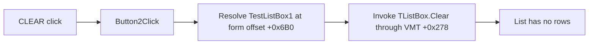

# CLEAR

## Control

| Property | Recovered value |
| --- | --- |
| Form | TesztForm1 |
| Component path | TesztForm1.Button2 |
| Control class | TButton |
| Caption | CLEAR |
| Hint | Not present in the recovered resource. |
| Text | Not present in the recovered resource. |
| Handler name | Button2Click |
| Handler address | 0115dce0 |
| Graph node | `resource:dfm:TesztForm1/TesztForm1.Button2` |
| Handler node | `function:0115dce0` |
| Graph layer | UI |

## What happens when clicked

The click clears all rows from `TesztForm1.TestListBox1`. The handler invokes
the parameterless virtual method at VMT offset `+0x278` on the form field at
`+0x6B0`. The TesztForm1 resource identifies its first and only `TListBox` as
`TestListBox1`. Independent recovered list-refresh code uses this same virtual
slot to clear `TListBox` controls before it adds new rows.

The handler has no empty-list guard, selection test, confirmation, branch, or
direct recovered call edge. The call is an indirect Delphi VCL dispatch. It
does not clear `TesztEdit1` or `symmetricalEdit1`, run the TESZT action, close
the form, save data, or report an error.

## Click flow

## Handler evidence

- Handler source: [FUN_0115dce0](../../../DecompiledSources/Tina16/functions/000000000115DCE0__FUN_0115dce0.c)
- Independent list-box clear evidence: [FUN_00e0bf30](../../../DecompiledSources/Tina16/functions/0000000000E0BF30__FUN_00e0bf30.c)
- Recovered role: Clear the TesztForm1 result list.
- Complexity: simple
- Distinct outgoing calls: 0

The DFM binds `TesztForm1.Button2.OnClick` to `Button2Click` at `0115dce0`.
The complete handler body invokes VMT slot `+0x278` on its `+0x6B0` field and
returns. `FUN_00e0bf30` establishes the slot as the direct clear operation for
`TListBox` controls: it calls that slot on two known list boxes, then appends
replacement rows through their `Items` objects.

## Direct calls

- No direct call edge is present because the handler dispatches the
  `TListBox.Clear` operation through the object's VMT.

## Resource evidence

- Kind: Not present in the recovered resource.
- Modal result: Not present in the recovered resource.
- Checked state: Not present in the recovered resource.
- List items: Not present in the recovered resource.
- Image reference: Not present in the recovered resource.
- Extracted glyph: None.
- `TestListBox1` is the only list box in the form. It occupies the large area
  above both edit controls and both buttons.

## Nearby label candidates

Nearby labels are layout candidates only. They are not proof of behavior.

- No same-parent label candidate is available.

## Analysis limits

- The handler does not preserve or export the removed rows. The recovered
  source does not show whether another action can recreate them.
