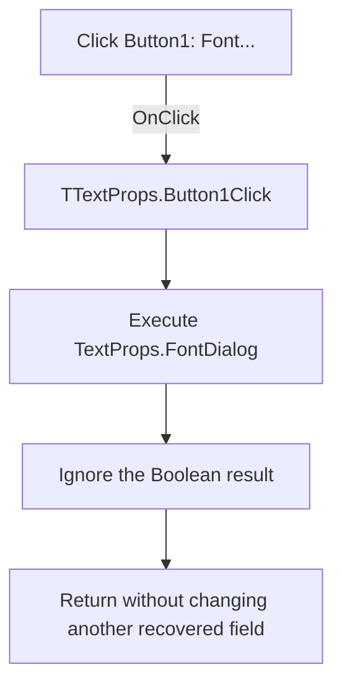

# &Font...

> Analysis status: Evidence-backed source review complete.

## Control

| Property | Recovered value |
| --- | --- |
| Form | TextProps |
| Component path | TextProps.Button1 |
| Control class | TButton |
| Caption | &Font... |
| Hint | Not present in the recovered resource. |
| Text | Not present in the recovered resource. |
| Handler name | Button1Click |
| Handler address | 017a11f0 |
| Graph node | `resource:dfm:TextProps/TextProps.Button1` |
| Handler node | `function:017a11f0` |
| Graph layer | UI |

## What happens when clicked

`TTextProps.Button1Click` executes the form's `TFontDialog`. The recovered code makes one indirect virtual call through slot `0xa8` on the component field at form offset `+0x6e0`. The DFM identifies `TextProps.FontDialog` as the form's only `TFontDialog`. A parallel recovered font command uses the same virtual slot to execute its font dialog and tests the returned Boolean value.

This handler ignores that Boolean value. It does not inspect `Sender`, branch on an accepted or cancelled result, copy `FontDialog.Font` to `TextEdit`, or change another recovered field. After the font dialog closes, the handler returns. It has no local exception handler.

## Click flow

## Handler evidence

- Source: [DecompiledSources/Tina16/functions/00000000017A11F0__FUN_017a11f0.c](../../../DecompiledSources/Tina16/functions/00000000017A11F0__FUN_017a11f0.c)
- Recovered role: Opens the form's font-selection dialog and ignores its result.
- Current graph summary: Handles 1 Delphi UI event: TextProps.Button1.OnClick.
- Current graph behavior: Calls the embedded `TFontDialog.Execute` method through its VMT and then returns without a result branch or a font assignment.
- Current graph evidence: The handler loads the form field at `+0x6e0` and calls VMT slot `+0xa8`. The DFM contains one `TFontDialog`, and the related [SignalEditorDlg font handler](../../../DecompiledSources/Tina16/functions/0000000001127440__FUN_01127440.c) uses the same slot as `Execute` before it tests the result and applies the accepted font.
- Complexity: simple
- Distinct outgoing calls: 0

## Direct and indirect calls

- No direct call edge is present in the recovered graph.
- The source contains one indirect VMT call. It executes the `TFontDialog` at form field `+0x6e0` through virtual slot `+0xa8`.
- The graph cannot resolve this indirect call to a function node, so the outgoing-call count stays zero.

## Resource evidence

- Kind: Not present in the recovered resource.
- Modal result: Not present in the recovered resource.
- Checked state: Not present in the recovered resource.
- List items: Not present in the recovered resource.
- Image reference: Not present in the recovered resource.
- Extracted glyph: None.
- Related component: `TextProps.FontDialog` is a nonvisual `TFontDialog` on the same form.
- Related editor: `TextProps.TextEdit` is present, but this click handler does not read or write it.

## Nearby label candidates

Nearby labels are layout candidates only. They are not proof of behavior.

- No same-parent label candidate is available.

## Analysis limits

- The decompiler does not recover the name of form field `+0x6e0`. The `FontDialog` identification uses the DFM component evidence and the matching virtual-call pattern in the related font handler.
- The handler does not expose the native font dialog's internal actions or the font properties that a user can select.
- The handler ignores the dialog result. The recovered code therefore does not prove how another routine later uses the dialog's selected font.
- The handler does not catch exceptions from the VCL dialog. Any exception leaves through the Delphi or VCL exception path.
