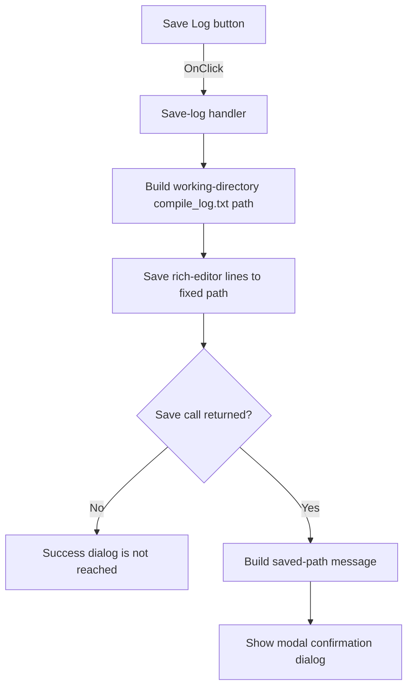

# Save Log

> Analysis status: Individually reviewed from recovered source.

## Control

| Property | Recovered value |
| --- | --- |
| Form | TextWindow |
| Component path | TextWindow.Panel1.sbSave |
| Control class | TSpeedButton |
| Caption | Not present in the recovered resource. |
| Hint | Save Log |
| Text | Not present in the recovered resource. |
| Handler name | sbSaveClick |
| Handler address | 015eb170 |
| Graph node | `resource:dfm:TextWindow/TextWindow.Panel1.sbSave` |
| Handler node | `function:015eb170` |
| Graph layer | UI |

## What happens when clicked

The handler joins the form's configured compiler working directory at offset `+0x6d8` with `\compile_log.txt`. It then asks the `Lines` object of the form's rich editor to save its current text to that fixed path. There is no file-selection dialog. After the save call returns, the handler builds `Logfile saved to: <path>` and shows it in a modal message dialog. The handler has no local error branch. If the save call does not return normally, the success message is not reached.

The field source is also recovered. `FUN_015eb2a0` copies a caller path into `+0x6d8`, and the compile-message coordinator `FUN_015ebc90` supplies its compiler working directory before it copies the compiler output into the rich editor and shows this window.

## Click flow

## Handler evidence

- Source: [DecompiledSources/Tina16/functions/00000000015EB170__FUN_015eb170.c](../../../DecompiledSources/Tina16/functions/00000000015EB170__FUN_015eb170.c)
- Recovered role: Saves the displayed compile log to its fixed working-directory file.
- Current graph summary: Handles 1 Delphi UI event: TextWindow.Panel1.sbSave.OnClick.
- Current graph behavior: Saves the rich-editor lines to `<compiler working directory>\compile_log.txt` and shows the saved path after success.
- Current graph evidence: FUN_015eb170 concatenates form field `+0x6d8` with `\compile_log.txt`, calls virtual slot `+0x100` on the rich editor's `Lines` object at `Edit + 0x510`, builds the success text, and calls the modal message wrapper 0072d440.
- Complexity: complex
- Distinct outgoing calls: 3

## Direct calls

- `function:00414480` — finalizes the temporary path and message strings.
- `function:00416ba0` — concatenates the directory and file name, then the message prefix and saved path.
- `function:0072d440` — opens the recovered modal message-dialog path.

## Resource evidence

- Kind: Not present in the recovered resource.
- Modal result: Not present in the recovered resource.
- Checked state: Not present in the recovered resource.
- List items: Not present in the recovered resource.
- Image reference: Not present in the recovered resource.
- Extracted glyph: [`0487_TextWindow_TextWindow_Panel1_sbSave_Glyph_Data.png`](../../../glyph/0487_TextWindow_TextWindow_Panel1_sbSave_Glyph_Data.png)

## Nearby label candidates

Nearby labels are layout candidates only. They are not proof of behavior.

- Rank 1: There are errors at distance 554.

## Analysis limits

- The two-frame glyph depicts a save symbol and agrees with the hint, but the handler source establishes the fixed output path and write operation.
- The nearby `There are errors` label is not part of the save call path and does not prove save-error handling.
- The recovered virtual call is consistent with `TStrings.SaveToFile`, but the exported source does not expose its exact Delphi method name, text encoding, or exception type.
